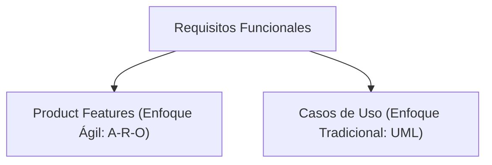

# Requisitos Funcionales y Especificación de Casos de Uso (UML)
> Guía académica y formal para el modelamiento funcional bajo el estándar de ingeniería de requisitos de la UPC.

---

## 1. Naturaleza de los Requisitos Funcionales

Los **Requisitos Funcionales** (RF) definen el comportamiento operativo, las transformaciones de datos, los flujos lógicos y las respuestas del sistema ante eventos externos. En el diseño de producto moderno, los requisitos funcionales de alto nivel se estructuran bajo la fórmula semántica **A-R-O** (Action-Result-Object):

$$\text{Feature} = \langle\text{Acción}\rangle + \langle\text{Resultado}\rangle + \langle\text{Objeto}\rangle$$

Donde:
* **Acción (Action):** El verbo operativo infinitivo que denota ejecución (ej. *Calcular*, *Generar*, *Registrar*).
* **Resultado (Result):** La restricción, el alcance o el impacto esperado (ej. *mensual*, *en tiempo real*, *sin límites*).
* **Objeto (Object):** La entidad de negocio o recurso afectado (ej. *reportes de nómina*, *alertas de seguridad*).

---

## 2. Los 7 Atributos de Calidad de los Requisitos (Estándar UPC)

Toda especificación de requisitos funcionales debe someterse a una auditoría de calidad basada en siete dimensiones fundamentales para mitigar riesgos durante la fase de codificación:

| Dimensión | Definición Técnica | Síntoma de Defecto | Ejemplo Correctivo |
| :--- | :--- | :--- | :--- |
| **1. Atómico (Atomic)** | El requisito describe una única e indivisible funcionalidad del negocio. | Uso de conjunciones que unen múltiples acciones independientes en una sola frase. | Dividir en requisitos independientes con IDs propios. |
| **2. Completo (Complete)** | Contiene toda la información y reglas necesarias para su implementación sin dejar lagunas. | Uso de expresiones vagas como "etcétera", "entre otros" o "de ser necesario". | Declarar de forma taxativa todas las condiciones de entrada y salida de datos. |
| **3. Consistente y sin ambigüedad (Consistent)** | Posee una única interpretación lógica y no se contradice con otros requisitos del sistema. | Conflictos de lógica (ej. REQ-01 dice que el DNI tiene 8 dígitos y REQ-12 dice que permite alfanuméricos). | Armonizar la terminología y las restricciones con el Glosario y el Modelo de Datos. |
| **4. Trazable (Traceable)** | Cada requisito se asocia de forma bidireccional a una regla de negocio (BRD) o necesidad del stakeholder. | Requisitos huérfanos que aparecen en el diseño técnico sin justificación de negocio. | Mapear cada REQ a un ID específico en el documento de especificación de negocio. |
| **5. Priorizado (Prioritized)** | Clasifica la importancia del requisito dentro de la escala de entrega de valor (ej. MoSCoW o Numérica). | Todos los requisitos figuran con la misma urgencia de implementación. | Clasificar en niveles (ej. Prioridad 1: Crítico, Prioridad 2: Medio, Prioridad 3: Opcional). |
| **6. Comprobable / Verificable (Testable)** | Formulado de manera binaria (pasa/falla) para que QA pueda comprobarlo empíricamente. | Criterios subjetivos como "El guardado debe ser rápido" o "La interfaz debe ser amigable". | Sustituir por valores cuantificables (ej. "en un tiempo de respuesta inferior a 2 segundos"). |
| **7. Identificado de forma única (Unique ID)** | Cada requisito dispone de una clave alfanumérica única y secuencial. | Requisitos referenciados por su texto descriptivo o números cambiantes. | Estructura de codificación normalizada (ej. `REQ-FN-001`, `REQ-FN-002`). |

---

## 3. Especificación Formal de Casos de Uso (UML)

Un **Caso de Uso** modela de forma detallada la interacción transaccional entre un actor (usuario o sistema externo) y la aplicación para lograr un objetivo de valor. Su especificación formal debe contener los siguientes campos de control:

* **Nombre:** Estructurado como `Verbo + Objeto` (ej. *Matricular Alumno*).
* **Descripción breve:** Resumen del propósito y valor del caso de uso.
* **Actores:** Actor Primario (iniciador) y Actores Secundarios (sistemas externos de soporte).
* **Precondiciones:** Estado del sistema requerido antes de la ejecución.
* **Flujo Básico (Happy Path):** Secuencia lineal optimizada y numerada de pasos.
* **Flujos Alternativos:** Desviaciones, flujos opcionales o tratamientos de errores.

> [!IMPORTANT]
> **Regla de Oro de Referenciación:** Los flujos alternativos deben referenciar los pasos del flujo básico exclusivamente a través de su **Nombre de Paso** (ej. `Al inicio de VALIDAR_IDENTIDAD...`), nunca mediante números de paso correlativos. Esto evita la rotura y fragilidad de los enlaces al insertar nuevos pasos en el flujo básico.

---

## 4. Matriz Comparativa de Calidad de Requisitos

### Caso 1: Gestión de Expedientes de Alumnos
* ❌ **Defectuoso (No atómico, ambiguo, no verificable):**  
  `REQ-FN-045`: "El sistema permitirá al coordinador registrar un nuevo alumno y subir sus documentos adjuntos en formato PDF, lo cual debe hacerse de forma muy rápida y segura."
* ✔️ **Correcto (Atómico, cuantitativo, trazable):**  
  `REQ-FN-045.1`: "El sistema permitirá al coordinador registrar los datos personales de un alumno (Nombres, Apellidos, DNI y Correo)." *(Prioridad 1, Trazable a BRD-3.2)*  
  `REQ-FN-045.2`: "El sistema permitirá al coordinador adjuntar archivos en formato PDF de tamaño menor a 5MB asociados al expediente del alumno." *(Prioridad 2, Trazable a BRD-3.3)*  
  `REQ-FN-045.3`: "El sistema completará el registro del alumno y el almacenamiento de sus archivos en un tiempo inferior a 3 segundos bajo condiciones normales de red." *(Prioridad 1, Trazable a BRD-3.4)*

---

## 5. Ejemplo de Especificación de Caso de Uso Completo

### Caso de Uso: Registrar Asignatura (UC-REG-01)

| Campo | Especificación Detallada |
| :--- | :--- |
| **ID / Nombre** | `UC-REG-01`: Registrar Asignatura |
| **Descripción** | Permite al Coordinador Académico crear una nueva asignatura en la malla curricular institucional del período vigente. |
| **Actor Primario** | Coordinador Académico |
| **Actores Secundarios** | Sistema de Registro Académico (SRA) externo |
| **Precondiciones** | El Coordinador Académico dispone de una sesión activa con permisos de gestión de malla curricular. |
| **Postcondiciones** | La asignatura queda registrada con estado "Inactiva" y se genera un identificador de asignatura único. |

#### Flujo Básico (Happy Path)
1. **SOLICITAR_REGISTRO:** El Coordinador Académico selecciona la opción de registrar asignatura.
2. **PRESENTAR_FORMULARIO:** El sistema despliega el formulario de datos obligatorios (Nombre de asignatura, Código, Créditos y Horas semanales).
3. **INGRESAR_DATOS:** El Coordinador Académico ingresa los datos de la asignatura y confirma el registro.
4. **VALIDAR_DISPONIBILIDAD:** El sistema consulta al SRA para asegurar que el código de la asignatura no existe previamente en la malla curricular activa.
5. **GUARDAR_DATOS:** El sistema persiste la asignatura en la base de datos con estado "Inactiva".
6. **NOTIFICAR_CONFIRMACION:** El sistema muestra una alerta de confirmación con el identificador asignado.

#### Flujos Alternativos

##### Flujo Alternativo A: Código de asignatura duplicado
* *Punto de Extensión:* En el paso **VALIDAR_DISPONIBILIDAD**, si el SRA detecta que el código ya está en uso.
* *Acción:*
  1. El sistema interrumpe el flujo básico de guardado.
  2. El sistema muestra la alerta "Código de asignatura duplicado en la malla curricular activa".
  3. El sistema retorna al paso **PRESENTAR_FORMULARIO** manteniendo los campos completados para su corrección.

##### Flujo Alternativo B: Conexión caída con el SRA
* *Punto de Extensión:* En el paso **VALIDAR_DISPONIBILIDAD**, si la conexión con el SRA externo experimenta un timeout.
* *Acción:*
  1. El sistema registra el error en el log técnico de auditoría.
  2. El sistema muestra la alerta "Servicio de validación temporalmente no disponible. Intente más tarde".
  3. El sistema aborta la transacción sin persistir datos en la base de datos.

---

## Referencias
* Karl Wiegers & Joy Beatty. (2013). *Software Requirements* (3rd ed.). Microsoft Press.
* Roger S. Pressman. (2005). *Software Engineering: A Practitioner's Approach* (6th ed.). McGraw-Hill.
* IEEE Computer Society. (1998). *IEEE Std 830-1998: IEEE Recommended Practice for Software Requirements Specifications*. IEEE.
* Ángel Augusto Vasquez Nuñez. (2021). *Requirements Analysis & Specification* (Material didáctico). Universidad Peruana de Ciencias Aplicadas (UPC).
