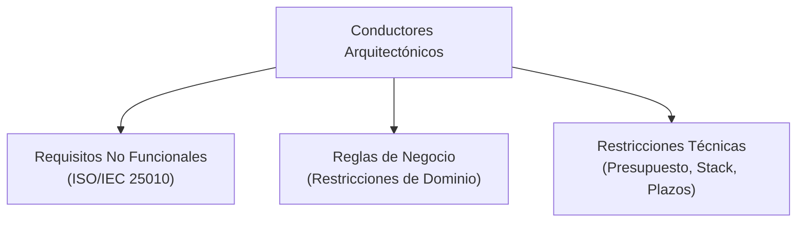

# Atributos de Calidad y Clasificación ISO/IEC 25010
> Guía académica y formal para la especificación cuantitativa de Requisitos No Funcionales (RNF) bajo los estándares de la UPC.

---

## 1. Naturaleza de los Requisitos No Funcionales

Los **Requisitos No Funcionales** (RNF o *Non-Functional Requirements*) determinan los atributos de calidad, restricciones operacionales y limitaciones técnicas sobre los servicios que el sistema ofrece. No describen *qué* hace el sistema, sino **cómo** realiza su trabajo. En la ingeniería de software, los RNF actúan como los principales **Architectural Drivers** (conductores arquitectónicos) que guían la selección de la infraestructura, patrones de diseño y tecnologías del proyecto.

---

## 2. Taxonomía de Calidad: Norma ISO/IEC 25010

El estándar internacional **ISO/IEC 25010** establece un modelo de calidad estructurado en ocho categorías de características del producto de software, cada una compuesta por subcaracterísticas específicas:

| Categoría Principal | Definición Técnica | Subcaracterísticas Clave |
| :--- | :--- | :--- |
| **1. Adecuación Funcional** | Grado en que las funciones del software cubren las necesidades implícitas y explícitas de negocio. | Completitud, corrección y pertinencia funcional. |
| **2. Eficiencia de Desempeño** | Relación entre el comportamiento temporal y de recursos del software ante diferentes cargas de trabajo. | Comportamiento temporal, utilización de recursos y capacidad de carga. |
| **3. Compatibilidad** | Capacidad del sistema para coexistir e interactuar de forma segura con otros productos en un mismo entorno. | Coexistencia e Interoperabilidad. |
| **4. Usabilidad** | Grado en el que el software puede ser empleado por usuarios específicos para lograr metas con efectividad. | Capacidad de aprendizaje, estética de la interfaz de usuario, accesibilidad. |
| **5. Fiabilidad** | Grado en que el sistema realiza funciones bajo condiciones y períodos de tiempo determinados de forma robusta. | Madurez, disponibilidad, tolerancia a fallos, recuperabilidad. |
| **6. Seguridad** | Capacidad del producto para proteger la información y datos, asegurando accesos autorizados exclusivos. | Confidencialidad, integridad, no repudio, responsabilidad, autenticidad. |
| **7. Mantenibilidad** | Eficacia y eficiencia con la que el software puede ser modificado por el equipo de ingeniería. | Modularidad, reusabilidad, analizabilidad, modificabilidad, capacidad de prueba. |
| **8. Portabilidad** | Facilidad con la que el software puede ser transferido de un entorno operativo (hardware/software) a otro. | Adaptabilidad, facilidad de instalación, reemplazabilidad. |

---

## 3. Reglas Estrictas de Redacción de RNF

Para asegurar el rigor científico e ingenieril requerido por la UPC, la redacción de RNF debe ceñirse a tres principios:

### A. Prohibición Absoluta de Adjetivos Subjetivos
Queda terminantemente prohibido utilizar descriptores abstractos y no medibles como *"rápido"*, *"eficiente"*, *"seguro"*, *"robusto"*, *"amigable"* o *"intuitivo"*. Todo requisito debe expresar una métrica exacta o una escala de tolerancia matemática.

### B. Mapeo Taxonómico Explícito
Cada RNF redactado debe llevar anexado de forma explícita el atributo y subatributo correspondiente de la norma ISO/IEC 25010 al final de su declaración.

### C. Plantilla Ágil de Restricción
Cuando se redacte en un entorno ágil, se puede utilizar la estructura adaptada a restricciones de calidad:

$$\text{US-RNF} = \text{Como } \langle\text{Rol/Sistema}\rangle + \text{Quiero } \langle\text{Atributo Medible}\rangle + \text{Para } \langle\text{Mitigar Riesgo de Calidad}\rangle$$

---

## 4. Matriz Comparativa de Cuantificación (Subjetivo vs Cuantitativo)

| Atributo (ISO 25010) | Redacción Deficiente (Subjetiva) | Redacción Rigurosa (Cuantitativa / Estándar UPC) |
| :--- | :--- | :--- |
| **Eficiencia de Desempeño / Comportamiento Temporal** | "El backend de la aplicación debe responder rápido a las solicitudes del usuario." | "El sistema responderá al 95% de las solicitudes HTTP GET en un tiempo inferior a 250 ms bajo una carga concurrente de 1000 peticiones por segundo. *(ISO/IEC 25010: Performance Efficiency / Time Behaviour)*" |
| **Fiabilidad / Disponibilidad** | "El servidor web debe estar activo siempre y casi no tener caídas durante el año." | "El servicio backend mantendrá una disponibilidad anual mínima del 99.95% (equivalente a un máximo acumulativo de 4.38 horas de inactividad anual). *(ISO/IEC 25010: Reliability / Availability)*" |
| **Seguridad / Confidencialidad** | "La base de datos debe encriptar las contraseñas de los usuarios para que nadie las robe." | "Las contraseñas de los usuarios serán almacenadas aplicando la función de derivación de claves Argon2id con sal única por registro. *(ISO/IEC 25010: Security / Confidentiality)*" |
| **Usabilidad / Accesibilidad** | "El sitio web del portal institucional debe ser apto para personas con discapacidades visuales." | "La interfaz de usuario cumplirá con las pautas de accesibilidad WCAG 2.1 Nivel AA, asegurando un contraste mínimo de texto de 4.5:1 y soporte completo de navegación por teclado. *(ISO/IEC 25010: Usability / Accessibility)*" |
| **Portabilidad / Adaptabilidad** | "La app web debe poder ejecutarse en cualquier teléfono móvil inteligente." | "La aplicación web se renderizará de forma adaptativa en dispositivos móviles con resoluciones que van desde 360x640px hasta 1080x1920px en los navegadores Chrome Mobile v110+ y Safari iOS 16+. *(ISO/IEC 25010: Portability / Adaptability)*" |

---

## 5. Escenarios de Calidad e Ingeniería de Arquitectura

Para formalizar y probar los atributos de calidad durante el diseño de la arquitectura, se emplean los **Escenarios de Calidad** (SEI - Software Engineering Institute). Se definen mediante la siguiente estructura de seis partes:

$$\text{Escenario de Calidad} = \langle\text{Source}\rangle + \langle\text{Stimulus}\rangle + \langle\text{Artifact}\rangle + \langle\text{Environment}\rangle + \langle\text{Response}\rangle + \langle\text{Response Measure}\rangle$$

1. **Fuente del estímulo (Source):** La entidad interna o externa que genera el estímulo (ej. *un usuario concurrente*, *un atacante*, *un fallo de hardware*).
2. **Estímulo (Stimulus):** La condición o evento que llega al sistema (ej. *solicitudes masivas de lectura*, *inyección de SQL*, *desconexión del nodo BD*).
3. **Artefacto (Artifact):** La parte o subsistema afectado (ej. *la base de datos*, *la interfaz de pago*, *el balanceador de carga*).
4. **Entorno (Environment):** Las condiciones operativas en las que ocurre (ej. *bajo carga pico*, *en mantenimiento programado*, *en condiciones normales*).
5. **Respuesta (Response):** La reacción del sistema ante el estímulo (ej. *procesar transacciones de forma degradada*, *bloquear IP sospechosa*, *levantar un nodo de réplica*).
6. **Medida de la respuesta (Response Measure):** La métrica exacta y medible que evalúa la respuesta (ej. *en menos de 10 segundos*, *cero pérdida de datos*, *error rate inferior a 0.1%*).

### Ejemplo de Escenario de Calidad de Disponibilidad (Reliability / Recoverability)

* **Fuente:** Un fallo físico de hardware en el nodo principal de base de datos.
* **Estímulo:** El nodo de base de datos primario queda fuera de línea de forma inesperada.
* **Artefacto:** El módulo de almacenamiento y base de datos relacional.
* **Entorno:** Operación normal del sistema en entorno de producción.
* **Respuesta:** El sistema detecta la caída del servicio, realiza la promoción de una réplica a nodo maestro y redirige el tráfico de lectura/escritura.
* **Medida:** La conmutación por error (*failover*) se completa automáticamente en un tiempo inferior a 30 segundos, manteniendo la integridad de las transacciones (cero pérdida de datos confirmados).

---

## Referencias
* ISO/IEC. (2011). *ISO/IEC 25010:2011 Systems and software engineering — Systems and software Quality Requirements and Evaluation (SQuaRE) — System and software quality models*. International Organization for Standardization.
* Karl Wiegers & Joy Beatty. (2013). *Software Requirements* (3rd ed.). Microsoft Press.
* Ángel Augusto Vasquez Nuñez. (2021). *Requirements Analysis Part II* (Material didáctico). Universidad Peruana de Ciencias Aplicadas (UPC).
