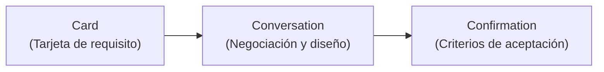

# Especificación de Historias de Usuario, Criterios INVEST y Desarrollo Guiado por Comportamiento (BDD)
> Guía académica y formal para el diseño ágil de requerimientos bajo el enfoque de ingeniería de software de la UPC.

---

## 1. Fundamentos y el Enfoque Centrado en el Usuario (Las 3 Cs)

Las **Historias de Usuario** (*User Stories*) son representaciones concisas en lenguaje natural de los requisitos del sistema, enfocadas en proporcionar valor al usuario final o al negocio. Conceptualmente, no deben entenderse como especificaciones estáticas, sino como vehículos para la colaboración continua bajo el modelo de las **3 Cs** (Ron Jeffries):

1. **Card (Tarjeta):** La representación física o digital que condensa el alcance de la necesidad del usuario.
2. **Conversation (Conversación):** Las interacciones verbales e iteraciones de diseño entre el *Product Owner*, el equipo de desarrollo y el área de QA para refinar los requisitos.
3. **Confirmation (Confirmación):** Los criterios de aceptación verificables acordados que determinan cuándo una historia ha sido implementada correctamente.



---

## 2. Taxonomía de Calidad: El Acrónimo INVEST

El estándar de ingeniería de requisitos exige que cada Historia de Usuario en el *Product Backlog* sea validada frente a los criterios **INVEST** (William C. Wake) antes de considerarse en estado *Ready* (DoR).

Matemáticamente, la viabilidad de una historia de usuario se puede representar como el producto de la satisfacción de cada criterio:

$$\text{Viabilidad}_{US} = \prod_{c \in \{\text{I, N, V, E, S, T}\}} S(c)$$

Donde $S(c) = 1$ si el criterio se satisface por completo, y $S(c) = 0$ en caso de incumplimiento. Cualquier incumplimiento anula la viabilidad de desarrollo de la historia de usuario.

### Matriz de Criterios INVEST

| Criterio | Definición Técnica | Síntomas de Incumplimiento | Acción Correctiva |
| :--- | :--- | :--- | :--- |
| **I - Independent** | La historia debe poder implementarse, probarse e implementarse de forma aislada, minimizando acoplamientos técnicos o funcionales. | Historias bloqueadas en el Sprint a la espera de que otro equipo culmine una tabla o servicio. | Reestructurar la arquitectura de la historia aplicando *Story Splitting* por flujo funcional. |
| **N - Negotiable** | La tarjeta describe el qué y para qué, dejando el cómo sujeto a discusión entre diseñadores, desarrolladores y el PO. | Requisitos superespecificados con listas rígidas de controles de UI y consultas SQL exactas. | Eliminar detalles de implementación técnica; enfocarse en el comportamiento del negocio. |
| **V - Valuable** | Cada incremento de desarrollo debe aportar un beneficio perceptible y medible al cliente final o al negocio. | Historias puramente técnicas como "Crear base de datos" o "Configurar Docker". | Redactar como habilitador técnico o asociarla a la entrega directa de un *feature* de usuario. |
| **E - Estimable** | El equipo de desarrollo debe contar con el entendimiento suficiente para predecir el esfuerzo relativo (en *Story Points*). | Estimación con alta dispersión o asignación de "?" debido a la incertidumbre técnica o funcional. | Realizar un *Spike* de investigación o subdividir la historia para aislar la incertidumbre. |
| **S - Small** | La historia debe tener un tamaño que permita completarla y probarla holgadamente dentro de una iteración (Sprint). | Historias gigantes (*Epics*) que experimentan desbordamiento (*spillover*) a lo largo de múltiples Sprints. | Aplicar patrones de división de historias (por tipo de datos, flujos feliz/excepcional, o roles). |
| **T - Testable** | Debe existir un conjunto de condiciones de aceptación objetivas e inequívocas que faciliten la validación mediante pruebas. | Criterios ambiguos como "La interfaz de usuario debe ser amigable" o "El sistema debe responder rápido". | Cuantificar las restricciones o especificar flujos exactos usando la sintaxis Gherkin (BDD). |

---

## 3. Desarrollo Guiado por Comportamiento (BDD) y Gherkin

El **Desarrollo Guiado por Comportamiento** (*Behavior-Driven Development* o BDD) formaliza la conversación sobre los requisitos en una especificación ejecutable. Utiliza la sintaxis estructurada **Gherkin**, traduciendo el comportamiento del sistema a escenarios comprensibles para perfiles de negocio e ingenieros por igual.

### Estructura de Escenarios (Given-When-Then)

El ciclo de comportamiento se define bajo la estructura secuencial:

$$\text{Escenario} = \text{Dado que (Precondición)} \rightarrow \text{Cuando (Evento Disparador)} \rightarrow \text{Entonces (Efecto Colateral)}$$

* **Dado que (Given):** Describe el estado preexistente del sistema. Se formula en **tiempo presente o presente perfecto**. No debe contener acciones de interacción del usuario.
* **Cuando (When):** Representa el evento o acción inicial ejecutada sobre el sistema. Se formula en **tiempo presente**.
* **Entonces (Then):** Expresa el resultado esperado o el cambio de estado del sistema. Se formula en **tiempo presente**.
* **Y / Pero (And / But):** Conectores lógicos que extienden las cláusulas precedentes sin repetir la palabra clave principal.

---

## 4. Reglas Estrictas de Redacción de Criterios de Aceptación

Para asegurar el rigor metodológico exigido en la UPC, toda especificación en Gherkin debe alinearse con las siguientes directrices:

### 1. Prohibición de Aseveraciones Imperativas y Condicionales en Títulos
Queda terminantemente prohibido utilizar términos como `Verify`, `Assert`, `Should`, `Verificar`, `Validar` o `Debería` en el título del escenario. Los títulos deben describir el caso de negocio real de manera descriptiva.
* *Incorrecto:* `Verify that the system shows an error when password is wrong`
* *Correcto:* `Autenticación con contraseña incorrecta`

### 2. Prohibición de Conjunciones en Títulos
Los títulos no deben contener conjunciones coordinadas o disyuntivas (`and`, `or`, `but`, `y`, `o`, `pero`). La presencia de una conjunción indica que el escenario abarca más de un flujo y debe ser dividido.
* *Incorrecto:* `El usuario inicia sesión y actualiza su perfil`
* *Correcto (Escenario 1):* `Autenticación de usuario`
* *Correcto (Escenario 2):* `Actualización de perfil de usuario`

### 3. Prohibición de Causalidades en Títulos
No se deben incluir porqués ni explicaciones de valor en los títulos (`because`, `since`, `so`, `para`, `debido a`). El valor funcional ya está explícito en la plantilla de la Historia de Usuario.
* *Incorrecto:* `Guardar historial de búsqueda para buscar más rápido`
* *Correcto:* `Registro de búsquedas del cliente`

### 4. Redacción Estricta en Tercera Persona
Todos los pasos del escenario se redactan de manera impersonal o en **tercera persona** (ej. *"El cliente ingresa"*, *"El sistema muestra"*). Nunca utilizar la primera persona (*"Yo ingreso"*, *"Cuando hago clic"*).

---

## 5. Matriz Comparativa de Redacción: Casos de Negocio

### Caso de Estudio A: Pasarela de Pagos E-Commerce

#### ❌ Redacción Deficiente (No INVEST, Primera Persona, Título incorrecto con imperativos)
> **Como** usuario  
> **Quiero** poder pagar con tarjeta  
> **Para** comprar mis cosas.  

```gherkin
Escenario: Verify that I can pay and should receive a confirmation email
  Dado que yo estoy en el checkout con un producto
  Cuando yo completo mis datos de tarjeta de crédito e ingreso mi CVV
  Y hago clic en pagar
  Entonces yo debería ver que mi pago fue exitoso y el sistema debería enviarme un email.
```

#### ✔️ Redacción Rigurosa (Estándar UPC, Tercera Persona, Títulos Atómicos, Criterios de Aceptación BDD)
> **Como** comprador registrado con un carrito de compras activo  
> **Quiero** procesar el pago de mi orden mediante una tarjeta de crédito válida  
> **Para** completar la adquisición de los productos seleccionados.  

```gherkin
Escenario: Transacción de pago aprobada
  Dado que el comprador se encuentra en la pantalla de confirmación de pago
  Y el carrito de compras cuenta con un monto total mayor a cero
  Cuando el comprador ingresa un número de tarjeta de crédito válido
  Y el comprador confirma la transacción de pago
  Entonces el sistema procesa el cargo financiero a través de la pasarela
  Y el sistema despliega el comprobante de pago digital
  Y el sistema notifica el resumen de la compra a la dirección de correo registrada.

Escenario: Transacción rechazada por saldo insuficiente
  Dado que el comprador se encuentra en la pantalla de confirmación de pago
  Y la tarjeta de crédito ingresada no dispone de cupo disponible suficiente
  Cuando el comprador confirma la transacción de pago
  Entonces el sistema rechaza la transacción de cargo financiero
  Y el sistema muestra el mensaje "Transacción declinada: Saldo insuficiente".
```

---

## Referencias
* Martin Fowler. (2013). *GivenWhenThen*. MartinFowler.com. https://martinfowler.com/bliki/GivenWhenThen.html
* Mountain Goat Software. (2015). *The Two Ways to Add Detail to User Stories*. https://www.mountaingoatsoftware.com/blog/the-two-ways-to-add-detail-to-user-stories
* Cucumber. (s.f.). *Gherkin Reference*. Cucumber Docs. https://cucumber.io
* Ángel Augusto Vasquez Nuñez. (2021). *User Stories & Acceptance Criteria* (Material didáctico). Universidad Peruana de Ciencias Aplicadas (UPC).
