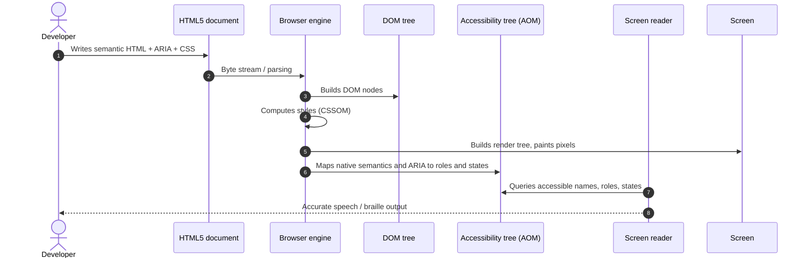

# Accessibility: POUR, the accessibility tree, and WAI-ARIA

## The four WCAG 2.2 principles (POUR)

- **Perceivable** — text alternatives, captions, sufficient contrast, content that does not rely on color
  or shape alone.
- **Operable** — everything reachable **by keyboard**, no focus traps, enough time, no seizure-inducing
  content, adequately sized touch targets.
- **Understandable** — language declared, predictable behaviour, errors identified and explained,
  consistent help.
- **Robust** — valid markup, with name, role and value correctly exposed to assistive technology.

**Level AA** is the practical target and the one most regulations require (Section 508 in the US,
EN 301 549 in the EU, and local digital-inclusion law).

## From DOM to accessibility tree



Each AOM node exposes four fundamental properties to the platform accessibility APIs (MSAA, UIA, AXAPI, ATK):

1. **Name** — the accessible name and where its text comes from.
2. **Role** — the kind of element or landmark (`button`, `navigation`, `main`, `heading`).
3. **State** — the current interactive condition (`expanded: true`, `checked: false`, `disabled: true`).
4. **Value** — the numeric or textual value (`valuenow: 50` on a progress bar).

Understanding that this tree exists explains most defects: a visually perfect element can reach the tree
with no name, or with a role that contradicts its behaviour.

## ARIA: roles, states, properties

- **Roles** — what the element is: `role="tab"`, `role="dialog"`, `role="alert"`.
- **States** — dynamic condition: `aria-expanded`, `aria-checked`, `aria-selected`, `aria-disabled`,
  `aria-current`.
- **Properties** — stable characteristics: `aria-label`, `aria-labelledby`, `aria-describedby`,
  `aria-controls`, `aria-haspopup`.

### `aria-expanded` + `aria-controls`

For triggers that collapse or expand a panel (hamburger menus, accordions, disclosures):

```html
<button type="button" aria-expanded="false" aria-controls="main-menu" id="menu-trigger">
  Main menu
</button>
<nav id="main-menu" aria-labelledby="menu-trigger" hidden>
  <!-- links -->
</nav>
```

### `aria-label` vs `aria-labelledby` vs `aria-describedby`

```html
<!-- aria-label: direct accessible name when no visible text exists -->
<button type="button" aria-label="Close dialog">
  <svg aria-hidden="true" focusable="false"><!-- X icon --></svg>
</button>

<!-- aria-labelledby: name taken from another visible element -->
<section aria-labelledby="summary-heading">
  <h2 id="summary-heading">Executive summary</h2>
</section>

<!-- aria-describedby: supplementary information, not the primary name -->
<input type="password" id="pass" aria-describedby="pass-rules">
<p id="pass-rules">Must contain at least 8 characters and one digit.</p>
```

### Live regions

Announce dynamic DOM changes without moving focus.

- `aria-live="polite"` — waits for the user to finish their current action. Success notifications,
  updated filters, result counts.
- `aria-live="assertive"` — interrupts immediately. System errors, sessions about to expire. Use sparingly.

### Accessible hiding: the `.sr-only` pattern

To give context to screen readers only, without altering the visual design:

```css
.sr-only {
  position: absolute;
  width: 1px;
  height: 1px;
  padding: 0;
  margin: -1px;
  overflow: hidden;
  clip: rect(0, 0, 0, 0);
  white-space: nowrap;
  border-width: 0;
}
```

> [!CAUTION]
> Never use `display: none` or `visibility: hidden` to hide text intended for screen readers — both
> remove the node from the accessibility tree, hiding it from screen and assistive technology alike.

## Common mistakes

- ARIA applied over native elements that already expressed the same thing, contradicting the semantics.
- `role="button"` with no keyboard or focus handling.
- Focus indicator removed.
- Modals that neither trap nor return focus.
- Decorative images with redundant alt text; informative images with `alt=""`.
- Form errors announced by color only.
- Relying on automated tooling alone: it detects roughly a third of real problems.

Focus and keyboard detail: [focus-and-keyboard.md](focus-and-keyboard.md).
Next step: [audit.md](audit.md).
