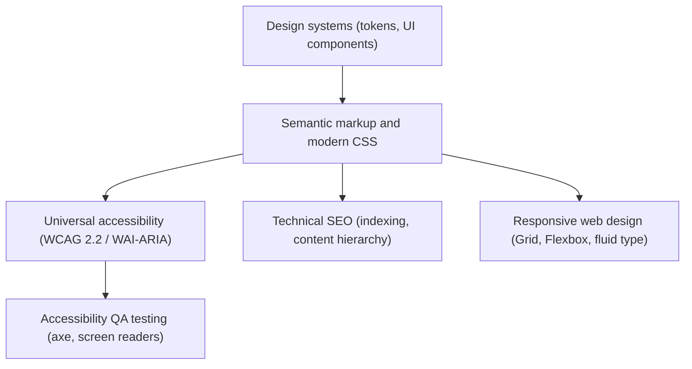

# Audit before shipping

## Questions that must be answered affirmatively and verifiably

1. **Structure** — Is there exactly one `<main>` and exactly one `<h1>` in the document? Does the heading
   outline read as a sensible table of contents?
2. **Landmarks** — Are all secondary regions (`<nav>`, `<section>`, `<aside>`) named with `aria-label` or
   `aria-labelledby` so the screen reader can distinguish them?
3. **Controls** — Is every element that performs an action a `<button>`, and every element that changes
   the URL an `<a>` with a valid `href`?
4. **Forms** — Does every field have a `<label>` explicitly associated via `for`/`id`, with error
   messages wired through `aria-describedby` and `aria-invalid`?
5. **Keyboard** — Can every interactive component be reached, operated and dismissed with the keyboard
   alone, with no focus trap and no invisible focus?
6. **Contrast and color** — Does normal text meet 4.5:1 against its background **in every theme**? Is
   critical information conveyed by something other than color alone?
7. **Language and alternatives** — Is `lang` set on `<html>`? Do informative images carry meaningful
   `alt`, and decorative ones `alt=""`?
8. **Motion and preferences** — Is `prefers-reduced-motion` honoured? Does the layout survive 200% zoom
   and a larger user font size?

## Anti-pattern table

| Anti-pattern | The error | Technical consequence | Correct solution |
| :--- | :--- | :--- | :--- |
| **Divitis / spanitis** | Nesting semantics-free `
`s to structure the page (`
`, `
`). | The AOM produces no landmarks. Screen reader users cannot jump between regions. | Replace with native elements: `<header>`, `<nav>`, `<main>`, `<article>`, `<aside>`, `<footer>`. |
| **ARIA overkill** | Adding redundant ARIA to native elements (`<button role="button">`, `<header role="banner">`). | Bloats the accessibility tree and can cause misinterpretation in older browsers. | Rule 1 of ARIA: never declare a role the native element already exposes implicitly. |
| **Focus removal (`outline: none`)** | `* { outline: none; }` with no visual replacement. | Keyboard navigation becomes unusable; the user cannot tell what is active. | `:focus-visible` with `outline: 3px solid var(--focus-color)` and `outline-offset`. |
| **Placeholder as label** | Omitting `<label>` and putting the instruction only in `placeholder`. | The placeholder disappears on typing, has low contrast, and is announced inconsistently. | Always keep a visible `<label for="id">` explicitly associated with the control. |
| **Skipped heading levels** | Jumping `<h1>` → `<h3>` to get a smaller font. | Corrupts the structural outline screen readers generate; harms SEO. | Keep a strict hierarchy and control size exclusively with CSS. |
| **Buttons built from `
` or href-less `<a>`** | `
`. | Not keyboard focusable, no Enter/Space activation, no button role in the AOM. | Use native `<button type="button">`. |

## Tooling, and its limits

Run automated checks — Lighthouse, axe-core, WAVE, pa11y — then do the manual pass. Automated tooling
detects roughly **30–50%** of accessibility problems; logical reading order, alt-text quality, focus
order sanity and semantic coherence all require human evaluation.

Manual pass, in order:

1. Navigate the whole interface with the keyboard only.
2. Run a screen reader (NVDA on Windows, VoiceOver on macOS/iOS, Orca on Linux) over the primary flow.
3. Zoom to 200% and check nothing overlaps or is cut off.
4. Switch themes and re-check contrast.

Note that engines (Blink, WebKit, Gecko) map some ARIA attributes to the accessibility tree in subtly
different ways; verify critical widgets in more than one.

## Recommendations

1. **Shift accessibility left** — define color contrast, focus order and accessible names in the design
   file before coding starts.
2. **Automate in CI** — wire `@axe-core/cli` or `pa11y` into the pipeline to block pull requests that
   introduce detectable WCAG 2.2 violations.
3. **Centralise tokens** — keep all color, typography and spacing custom properties in one base file
   (`tokens.css`), so contrast can be audited in one place. See [theming.md](theming.md).
4. **Train the team on screen readers** — developers and QA should be able to run a basic screen-reader
   pass themselves.

## Related disciplines

- [design-system-patterns](../../design-system-patterns/SKILL.md) and
  [design-systems](../../design-systems/SKILL.md) — the token and
  component layer built on top of this substrate.
- [web-design-guidelines](../../web-design-guidelines/SKILL.md) — broader interface-guideline review.
- [responsive-design](../../responsive-design/SKILL.md) — adaptation across viewports.
