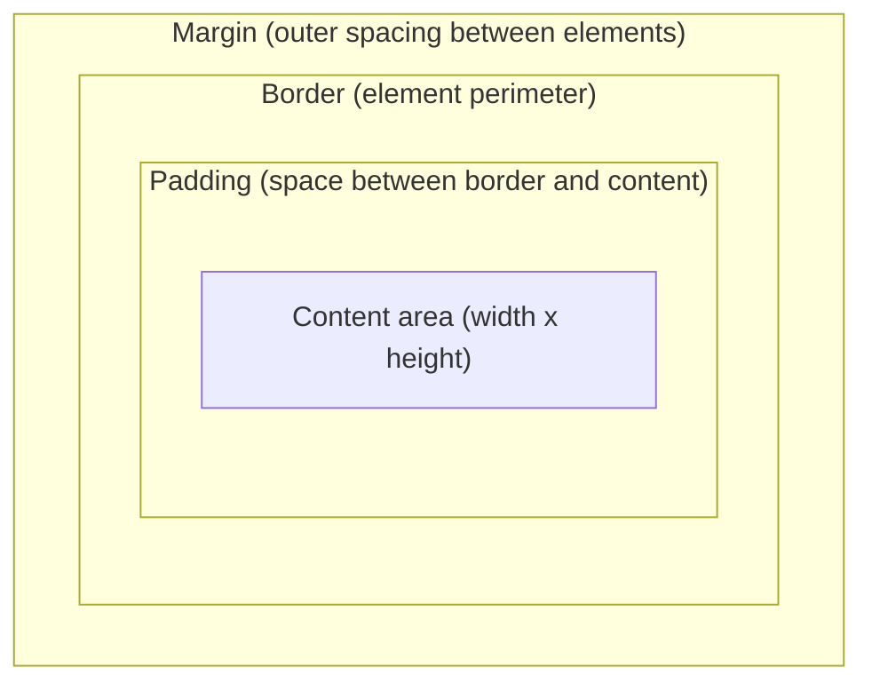
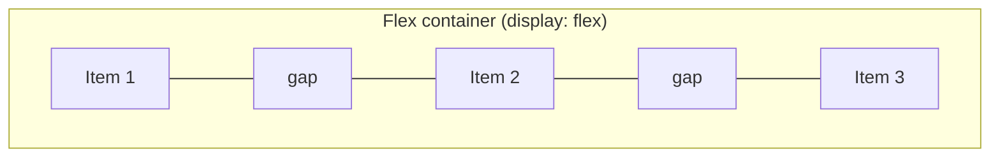
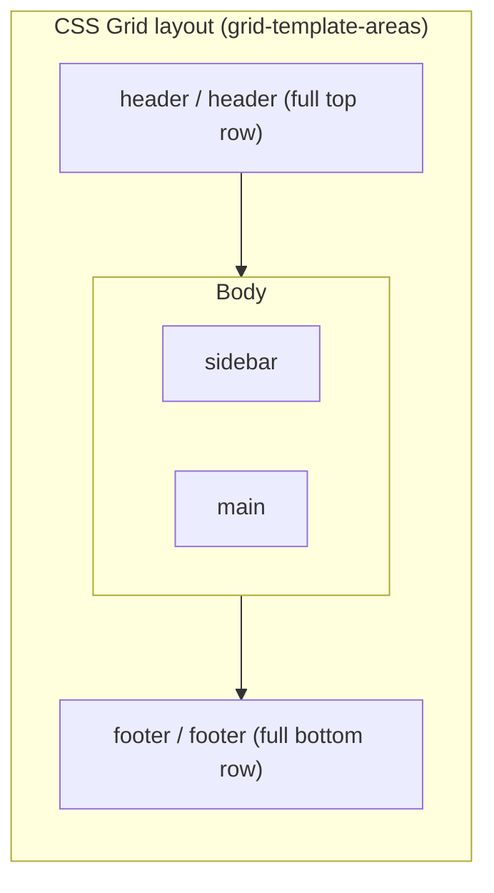

# Layout: box model, Flexbox, Grid, CSS architecture

## 1. Box model and `box-sizing`

Every element in the document flow renders as a rectangular box of four concentric layers:



- **`box-sizing: content-box`** (historical default): `width`/`height` apply to the content area only.
  Padding and border are **added** on top (`total = width + padding + border`), which causes accidental
  overflow.
- **`box-sizing: border-box`** (modern universal standard): `width`/`height` include padding and border;
  the content area shrinks to fit. Predictable sizing.

Apply it globally — it is the first line of any modern stylesheet:

```css
*, *::before, *::after { box-sizing: border-box; }
```

**Margin collapsing**: in normal block flow, adjacent vertical margins do not add up — they collapse to
the larger value. Collapsing does not happen inside Flexbox or Grid containers, which is one more reason
to use them and to space children with `gap`.

## 2. Flexbox — one dimension

Distributes and aligns items along **one** axis at a time; the content dictates the size.



- **Main axis** (`justify-content`): `flex-start`, `center`, `flex-end`, `space-between`, `space-around`.
- **Cross axis** (`align-items`): `stretch`, `center`, `flex-start`, `flex-end`, `baseline`.
- **`gap`** replaces manual margins on children and leaves no residual edge margins.

Choose Flexbox for: navigation bars, button rows, vertical centring, and any group of items that should
share the available space along one axis.

## 3. CSS Grid — two dimensions

Defines rows and columns simultaneously; the container dictates the structure.



- **`fr`**: distributes free space proportionally.
- **`minmax(min, max)`**: an elastic size range that prevents overflow without constant media queries.
- **`repeat(auto-fit | auto-fill, minmax(...))`**: automatically responsive grids driven by container space.
- **`grid-template-areas`**: expresses the layout readably in the stylesheet.
- **`subgrid`**: lets nested items align to the parent's tracks. Widely supported in modern browsers;
  legacy targets may need a Flexbox or plain-Grid fallback.

```css
/* Responsive layout with no media queries */
.dashboard-grid {
  display: grid;
  grid-template-columns: repeat(auto-fit, minmax(280px, 1fr));
  gap: 1.5rem;
}
```

Choose Grid for: the page skeleton, galleries, multi-column forms, dashboards — anything where alignment
matters on both axes.

**Rule of thumb: Grid for layout, Flexbox for components.** They compose freely — a grid item can itself
be a flex container.

## 4. CSS architecture

| Methodology | Key principles | Advantages | Trade-offs | Best fit |
| :--- | :--- | :--- | :--- | :--- |
| **BEM** (`block__element--modifier`) | Independent blocks (`.card`), descendant elements (`.card__title`), state modifiers (`.card--highlighted`). | Flat, predictable specificity (one class). Self-documents structure in the markup. | Verbose class names; needs naming discipline across a team. | Corporate design systems, framework-agnostic component libraries. |
| **ITCSS** | Stylesheets organised into layers of increasing specificity: settings, tools, generic, elements, objects, components, utilities. | Solves specificity by source order. Scales across large codebases. | Requires build discipline and team buy-in on layer boundaries. | Large, long-lived stylesheets. |
| **Utility-first** (e.g. Tailwind) | Atomic single-purpose classes composed in the markup (`flex`, `p-4`, `focus:ring-2`). | Very fast; no class naming; near-zero unused CSS in production. | Dense markup coupled to presentation; utility vocabulary to learn. | Prototyping, apps with encapsulated components (React/Vue). See [tailwind-design-system](../../tailwind-design-system/SKILL.md). |
| **CSS Modules** | Scope encapsulated by compile-time hashed class names. | Zero global collisions; total component decoupling. | Needs a bundler; global dynamic styles are awkward. | SPAs and microfrontends. |

Any of them works; mixing them without a rule does not. What ruins a stylesheet is the absence of a
convention, not which convention was chosen. Integrating BEM or CSS Modules into a legacy codebase with
deeply nested global selectors usually requires structural refactoring first.

## Common mistakes

- Not setting `box-sizing: border-box` and fighting widths that never add up.
- Grid for what is a single row of items, or Flexbox for a genuinely two-axis layout.
- Over-specific selectors that force escalating specificity on every fix, ending in `!important`.
- Margins between siblings where `gap` was the answer.
- Absolute positioning used as a layout system.
- Fixed widths and heights that break with real content or with the user's font size.

Next step: [theming.md](theming.md).
