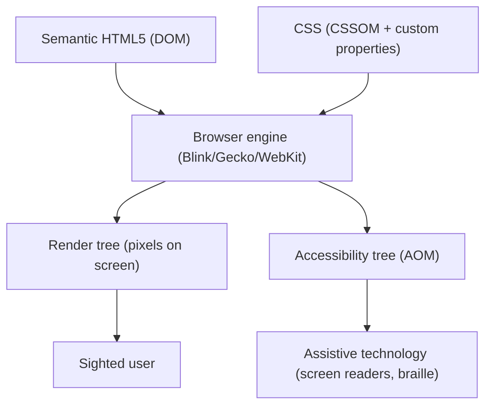
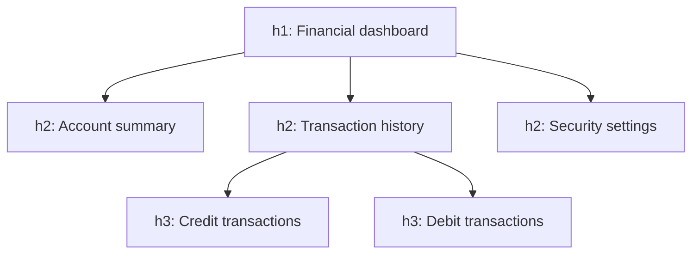

# Document structure: landmarks and heading hierarchy

Semantic HTML expresses **what** each part of the document is, not how it looks. That meaning is what
screen readers, search engines, reader mode and automation tooling consume. A document made of nested
`
`s is invisible to all of them.

## The rendering pipeline

The browser builds two structures from the same source. Styling only touches one of them. Structure
touches both.

## Landmark elements

| Element | Implicit landmark role | Semantic contract | Uniqueness rule |
| :--- | :--- | :--- | :--- |
| `<header>` | `banner` (at root context) | Header of the document or of a section/article: logo, title, metadata. | At most one global `banner`. Multiple allowed when nested in `<article>` or `<section>`. |
| `<nav>` | `navigation` | Block of significant navigation links. | Only for primary navigation blocks, not every group of links. Label with `aria-label`/`aria-labelledby` when there is more than one. |
| `<main>` | `main` | The document's principal, unique content. | **Strictly one** visible per document. Must not contain global navigation, footers or shared sidebars. |
| `<section>` | `region` (only when it has an accessible name) | Thematic grouping of related content. | Must have a heading (`<h2>`–`<h6>`), preferably wired with `aria-labelledby`. A section with no heading is almost always a `
`. |
| `<article>` | `article` | Self-contained composition that would still make sense extracted: post, news item, product card, comment. | Must be understandable on its own; usually carries its own heading. |
| `<aside>` | `complementary` | Content tangential to the main flow: sidebars, related links, glossaries. | Must not carry the primary application flow. |
| `<footer>` | `contentinfo` (at root context) | Footer of the document or section: copyright, legal links, authorship. | At most one global `contentinfo`. Multiple allowed when nested. |
| `<figure>` / `<figcaption>` | `figure` | Media, diagrams or code listings with their caption. | `<figcaption>` must be the first or last direct child of `<figure>`. |

Landmarks let a screen reader user jump straight to the content. They are the highest
cost-benefit accessibility improvement that exists.

## Heading hierarchy

- **One `<h1>` per page**, naming the main content.
- `<h2>`–`<h6>` are strictly subordinate. **Never skip a level** (`h2` → `h4`) for typographic reasons.
- The level expresses **structure**; the size is decided by CSS.
- The list of a page's headings must read like its table of contents. If it makes no sense read alone,
  the structure is wrong.

## Content elements

Avoid indiscriminate `
`. Use `<article>` for autonomous entities, `<section>` for titled thematic
divisions, `<figure>` for graphics with `<figcaption>`, and `
`, `<ul>`, `<ol>`, `<dl>` for text.
Lists built from loose `
`s lose the item count a screen reader announces. ` ` is not a paragraph
separator; `
` is. Tables are for tabular data — with `<caption>`, `<thead>` and `<th scope>` — never
for layout, and never replaced by `
`s when the data is genuinely tabular.

## Always

- `<html lang="…">` so speech synthesis uses the right phonetics.
- Precise `alt` on informative images (`alt="Microservices architecture diagram"`), explicit `alt=""`
  on decorative ones so the accessibility tree ignores them.

## When this does not apply

Canvas 2D and WebGL interfaces cannot carry semantics on their pixels; provide a parallel accessible
tree or off-screen alternative content instead. Everything else on the standard web keeps the semantics.

Next step: [native-elements.md](native-elements.md).
