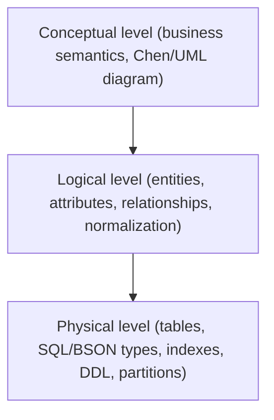

# Conceptual and logical modeling

## Levels of abstraction

1. **Conceptual level** — the business reality with no technology constraints. Conceptual entities, general attributes, cardinalities (1:1, 1:N, N:M). Main artifact: a conceptual ERD or a domain class diagram.
2. **Logical level** — a formal data structure independent of any particular engine. Logical primary keys, foreign keys, formally typed attributes, nullability, normalization rules.
3. **Physical level** — the implementation in a specific DBMS. Physical tables, native types (`UUID`, `VARCHAR(n)`, `TIMESTAMPTZ`), B-Tree/GIN/GiST indexes, join tables, DDL constraints, partitioning, on-disk storage.

Keeping the three separate is what lets you change engine, or denormalize, without losing the meaning of the model.

## Step 1 — Entity discovery and cardinalities

Identify the domain's nouns and document the multiplicity between them:

- **1:1** — evaluate whether to merge the tables, or keep them apart for security or row-size reasons.
- **1:N** — the primary key of the `1` side migrates as a foreign key into the `N` side.
- **N:M** — always requires an intermediate/junction table; give it a semantic name (`enrollments`, not `student_course`) whenever the relationship itself is a business concept.

Validate the conceptual model with domain experts before going further. A modeling error caught here costs a conversation; caught after the DDL it costs a migration.

## Step 2 — Building the logical model

- Name entities in `UpperCamelCase`, singular.
- Assign attributes with abstract logical types (`Text`, `Integer`, `Date`, `Decimal`).
- Apply normalization successively (1NF → 2NF → 3NF → BCNF) — see [normal-forms.md](normal-forms.md).
- Document all candidate keys, the chosen primary key, and every logical foreign key.
- Record nullability and business invariants that will later become `CHECK` constraints.

## Alignment with the domain model

If the system is designed with DDD, the aggregate boundaries — not the tables — decide the transactional boundaries, and each aggregate root gets one repository. Model relationally *from* the aggregates rather than deriving the aggregates from a pre-existing schema. See [ddd-core: aggregate boundaries](../../domain-driven-design-ddd/ddd-core/references/aggregate-boundaries.md).

## Questions the design must answer

Before signing off on a data design, the team should be able to answer:

1. What is the estimated data volume and annual growth rate for each entity?
2. What is the read/write ratio?
3. What transactional isolation and consistency level does each use case require?
4. Are there entities with dynamic or highly mutable schemas that would justify a non-relational structure?
5. Are all foreign keys explicitly indexed?
6. How will schema migrations be governed in a CI/CD pipeline?
7. What are the RPO and RTO targets, and the disaster-recovery plan, for each datastore?
