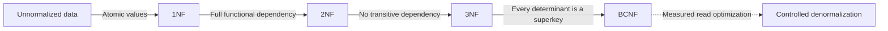

# Normal forms

Normalization is the formal decomposition of relational schemas to remove redundancy and avoid insert, update, and delete anomalies while preserving functional dependencies (`X → Y`).

Mnemonic: every non-key attribute must depend **on the key, on the whole key, and on nothing but the key**.

## First normal form (1NF)

A relation `R` is in 1NF if and only if:

- Every attribute holds atomic, indivisible values — no arrays, no comma-separated lists, no nested structures in a scalar column.
- There are no repeating column groups (`phone_1`, `phone_2`, `phone_3`).
- A primary key exists that uniquely identifies each tuple.

## Second normal form (2NF)

`R` is in 2NF if and only if:

- It is in 1NF.
- No non-prime attribute (one belonging to no candidate key) functionally depends on a *proper subset* of a composite primary key.
- Every non-trivial dependency `X → Y` where `X ⊂ composite PK` must be removed by extracting a new relation.

2NF only ever bites when the primary key is composite. With a single-column key, 1NF implies 2NF.

## Third normal form (3NF)

`R` is in 3NF if and only if:

- It is in 2NF.
- There are no transitive functional dependencies between non-prime attributes.
- For every non-trivial dependency `X → A`, either `X` is a superkey or `A` is part of a candidate key.

**3NF is the practical target** for essentially every transactional schema.

## Boyce-Codd normal form (BCNF)

`R` is in BCNF if and only if for every non-trivial functional dependency `X → A`, `X` is strictly a **superkey** of `R`.

BCNF removes the anomalies 3NF still tolerates when several composite candidate keys overlap. Beyond BCNF, the higher forms (4NF, 5NF) rarely change a real design decision.

## Working the decomposition

1. Write down the functional dependencies you can actually justify from the business rules — not the ones the current data happens to satisfy.
2. Find the candidate keys.
3. For each violating dependency, project it into its own relation whose key is the determinant, and keep a foreign key back.
4. Re-check: decomposition must be lossless, and should preserve dependencies where possible. When BCNF forces you to lose a dependency, staying at 3NF and enforcing that rule with a constraint is a legitimate choice — document it.

## Anomalies this prevents

- **Insertion** — you cannot record a new product category until some product exists in that category.
- **Update** — a supplier's address is stored on every line item, so a move requires touching thousands of rows and one missed row is silent corruption.
- **Deletion** — deleting the last order for a customer erases the only record of that customer's address.
