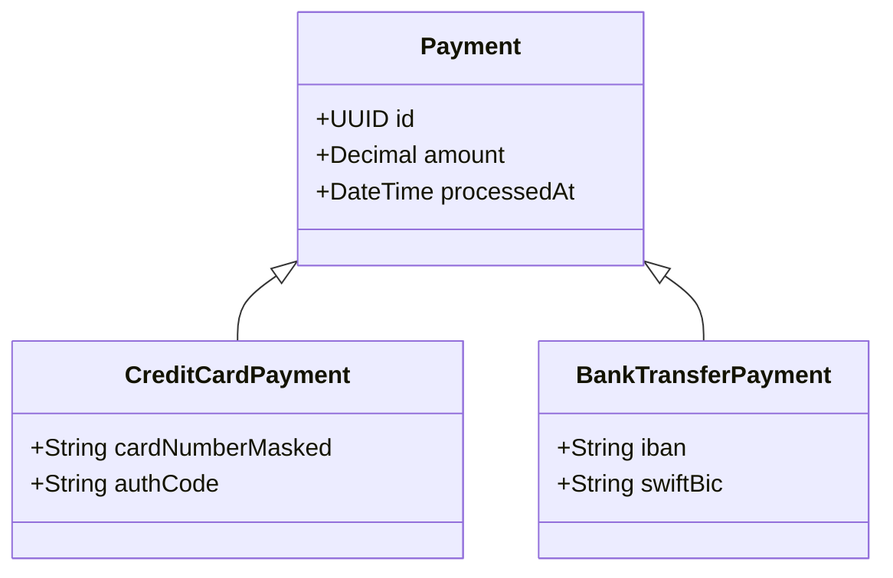

# Object-relational impedance and ORM usage

The **object-relational impedance mismatch** is the set of structural misalignments between an object model (encapsulation, polymorphism, identity by reference) and a relational model (mathematical sets, normalization, identity by key). Neither paradigm is defective; they have different purposes, and the ORM is the layer negotiating between them. Understanding the mismatch is what lets you use the ORM instead of being used by it.

## The five mismatches

1. **Granularity** — the object model has more classes than the schema has tables. An `Address` value object deserves no table of its own and is flattened into the parent's columns.
2. **Subtypes** — inheritance exists in objects and not in the relational model. You must pick a mapping strategy, and each sacrifices something (see below).
3. **Identity** — objects have identity by reference *and* equality; rows have a primary key. Defining `equals` by the identifier, not by the values, is what prevents erratic behavior in collections.
4. **Associations** — object references are **directional**; foreign keys are not. A bidirectional object relationship maps to a single foreign key, and you must decide which side owns it.
5. **Data navigation** — object code walks the graph (`order.customer.address`); the database performs when asked for everything at once. This mismatch is the direct source of the **N+1** problem.

## Inheritance mapping strategies (Fowler, PoEAA)



### Single Table Inheritance
- **Structure**: one table holds the whole hierarchy, with a discriminator column (`payment_type`).
- **Pros**: polymorphic queries with no joins; best raw performance.
- **Cons**: subclass-specific columns must be nullable, so schema-level integrity is lost.

### Class Table Inheritance (joined tables)
- **Structure**: the base class has its own table; each subclass has a separate table whose primary key is also a foreign key to the base table.
- **Pros**: strict 3NF; `NOT NULL` constraints usable on subclass columns.
- **Cons**: several `INNER JOIN`/`LEFT JOIN` operations to retrieve a complete polymorphic entity.

### Concrete Table Inheritance (table per concrete class)
- **Structure**: tables only for concrete subclasses, duplicating the base columns in each.
- **Pros**: no artificial nulls; fast reads of a single specific subclass.
- **Cons**: primary keys must not collide across tables; polymorphic queries over the base class require expensive `UNION ALL`.

Details and the surrounding pattern family: [poeaa/references/inheritance-mapping.md](../../software-architecture/poeaa/references/inheritance-mapping.md) and [poeaa/references/or-structural-patterns.md](../../software-architecture/poeaa/references/or-structural-patterns.md).

## The N+1 problem

N+1 occurs when the ORM runs 1 query to fetch a list of N parent rows and then N further individual queries to load the child associations in a loop: `queries = 1 + N`.

Mitigations:

1. **Join fetching** — one explicit statement:
   ```sql
   SELECT o.id, o.customer_id, oi.id, oi.product_id, oi.unit_price
   FROM orders o
   INNER JOIN order_items oi ON oi.order_id = o.id
   WHERE o.status = 'COMPLETED';
   ```
2. **Batch fetching** — configure the ORM to load associations in batches via `WHERE parent_id IN (?, ?, ...)`, reducing the count to `1 + ceil(N / batch_size)`.
3. **Entity graphs / projection DTOs** — declare projections selecting only the columns the use case actually needs.

## Working with an ORM without losing the domain

- **The domain does not import the ORM.** If the model carries persistence annotations, the dependency points the wrong way; use external mapping or a translation layer.
- **Map aggregates, not tables.** One repository per aggregate root. For the Java/Spring mechanics of that repository, see [java-25-ddd/references/infrastructure-repositories.md](../../domain-driven-design-ddd/java-25-ddd/references/infrastructure-repositories.md) rather than reinventing it here; for the identity/lifecycle rules the mapping must respect, see [ddd-core: object lifecycle](../../domain-driven-design-ddd/ddd-core/references/object-lifecycle.md).
- **Decide the fetch strategy per use case**, not globally: lazy by default, with explicit eager loading (`join fetch`, `include`) in the queries that walk the graph.
- **Read the generated SQL.** An ORM whose queries nobody ever looks at ends in performance problems nobody can explain.
- **Drop to SQL without guilt** for reports and complex read queries — that is exactly what separates the query stack in [CQRS](../../domain-driven-design-ddd/ddd-core/references/cqrs.md).

## Anti-patterns

- Designing the object model as a mirror of the tables and calling it a domain model.
- Global eager loading to "fix" N+1, pulling the entire graph on every query.
- Bidirectional relationships with no declared owning side, producing lost or duplicated updates.
- `equals`/`hashCode` over all fields including the generated key, breaking collections before the entity is persisted.
- Fighting the ORM over complex reports instead of writing the query.
- ORM session open for the whole request, with managed entities leaking into the presentation layer.
- Serialization cost ignored: high-level mapping abstractions add real CPU overhead turning result sets into object instances.
