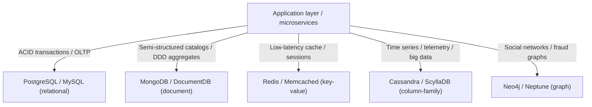
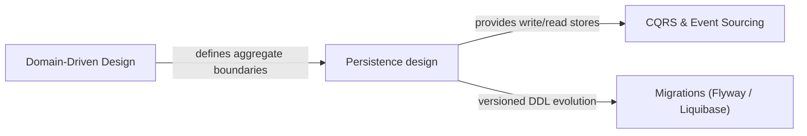

# Storage selection and polyglot persistence

Polyglot persistence means using **several storage technologies** in one system, each where it fits. The premise is that no single data model is optimal for every problem; the counterpart is that each added engine multiplies operational, knowledge, and consistency cost.

## Taxonomy and selection criteria

| Category | Representative engines | Data model | Primary strengths | Best-fit use cases |
| :--- | :--- | :--- | :--- | :--- |
| **Relational (RDBMS)** | PostgreSQL, MariaDB, Oracle | tables, tuples, foreign keys, SQL | ACID consistency, referential integrity, ad-hoc queries with joins | Accounting, order management, core banking, ERP, CRM |
| **Document** | MongoDB, Couchbase | hierarchical BSON/JSON documents | Flexible schema, self-contained aggregates, horizontal sharding | Product catalogs, CMS, dynamic profiles |
| **Key-value** | Redis, KeyDB, DynamoDB | key → binary or structured value | Sub-millisecond latency, in-memory ops, automatic TTL | Distributed cache, sessions, shopping carts, counters |
| **Wide-column** | Cassandra, ScyllaDB | tables partitioned by key, column families | Massive continuous writes, linear fault tolerance, AP model | IoT telemetry, time series, high-volume audit logs |
| **Graph** | Neo4j, Neptune | nodes, properties, directed edges | Efficient deep relationship traversal without costly joins | Fraud detection, recommendation engines, social graphs |
| **Search engine** | Elasticsearch, OpenSearch | inverted index over documents | Full-text search, faceting, relevance ranking | Site search, log exploration |
| **Time series** | TimescaleDB, InfluxDB, Prometheus | time-indexed measurements | Window aggregations, retention/downsampling policies | Metrics, telemetry, monitoring |

Relational remains the **correct default** for most business systems.

## How to decide

1. Start relational and stay there while it works. It is the option with the fewest surprises and the most available knowledge.
2. Add an engine only for a **concrete, measured** problem the current one handles badly — full-text search, deep relationship traversal, high-cardinality time series.
3. Count the full cost: operations, backup, monitoring, disaster recovery, and **people who know how to run it at three in the morning**.
4. Define the **source of truth** for every piece of data. Without that answer, duplication becomes corruption.
5. Design the **synchronization** explicitly and accept eventual consistency between engines: there are no free distributed transactions. Use Transactional Outbox rather than dual writes.
6. Align storage boundaries with bounded-context boundaries ([ddd-core: bounded contexts](../../domain-driven-design-ddd/ddd-core/references/bounded-contexts.md)); crossing them is what produces coupling through the database.

## Consistency models

### ACID vs BASE

| Characteristic | ACID (RDBMS / NewSQL) | BASE (distributed NoSQL) |
| :--- | :--- | :--- |
| **Atomicity / basic availability** | All or nothing; a failed operation rolls back entirely. | Basic availability via partitions and decentralized replicas. |
| **Consistency** | Strict, immediate integrity invariant per transaction. | Soft state: data may change without user input. |
| **Isolation / eventuality** | Concurrent transactions isolated (Read Committed, Serializable). | Eventual consistency: converges within finite time. |
| **Durability** | Changes persisted irreversibly in the write-ahead log. | Distributed durability by replica quorum. |
| **Primary use case** | Financial systems, critical inventory, transactional orders. | Social feeds, IoT telemetry, mass sessions, web catalogs. |

### CAP (Brewer, Gilbert & Lynch)

A distributed data system subject to network partitions (`P`) can guarantee only two of consistency, availability, and partition tolerance simultaneously — in practice, `P AND (C OR A)`.

- **CP** — prioritizes linearizable consistency over availability; under partition it rejects reads/writes from disconnected nodes (PostgreSQL with strict synchronous replication, MongoDB with `w: "majority"`).
- **AP** — prioritizes availability, accepting temporary divergence resolved later (Cassandra, DynamoDB, CouchDB).

### PACELC (Abadi)

Extends CAP by describing behavior when there is **no** partition: *if Partition then A vs C, Else Latency vs Consistency*.

- **PC/EC** (Bigtable, Spanner): consistency under partition, and consistency over low latency in normal operation.
- **PA/EL** (Cassandra, DynamoDB): availability under partition, and low latency over immediate consistency in normal operation.

## Relationship to other methodologies

- **DDD** — aggregate root boundaries determine relational transactional boundaries and define document granularity in NoSQL stores.
- **CQRS** — separates the write model (highly normalized in an RDBMS for ACID guarantees) from the read model (denormalized in a search engine, cache, or materialized views).
- **Event Sourcing** — instead of storing current state, persists the immutable sequence of domain events in an append-optimized event store.
- **Database migrations as code** — Flyway/Liquibase integrate versioned DDL into CI/CD pipelines.

## When not to bother

- Purely stateless utilities, in-memory stream transformers, throwaway CLIs.
- Throwaway prototypes where the data structure does not outlive one process.
- Low-volume or low-complexity systems where a single RDBMS satisfies every requirement at lower operational cost. Indiscriminate polyglot persistence there is pure overhead.

## Anti-patterns

- Adopting an engine because it is fashionable rather than because of a measured problem.
- Duplicating data in two engines without declaring which one is authoritative.
- Ignoring operational cost and ending up with five technologies and one person per technology.
- Expecting transactional guarantees across different engines.
- Databases shared between services, which annul any context boundary.
- Dismissing the relational model out of prejudice and reimplementing joins in application code.
- Uncontrolled EAV in a relational engine to fake a dynamic schema — use indexed native `JSONB`, or move that subdomain to a document store.
- No TTL policy on cache stores, exhausting RAM; configure eviction (`volatile-lru`) explicitly.
