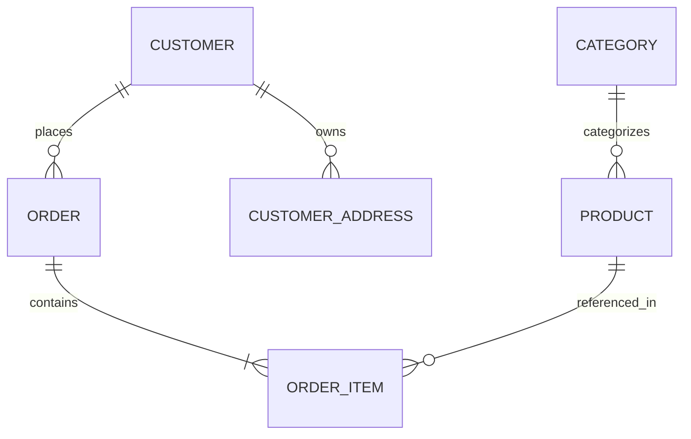
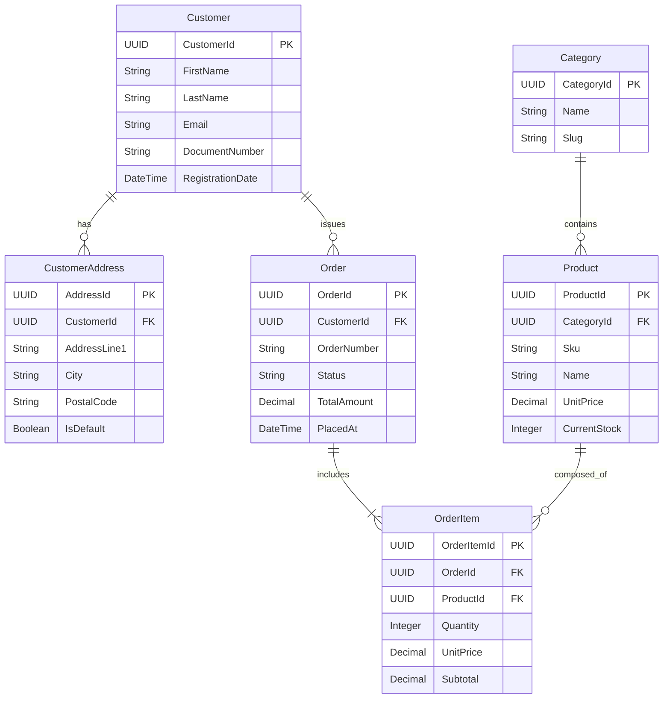
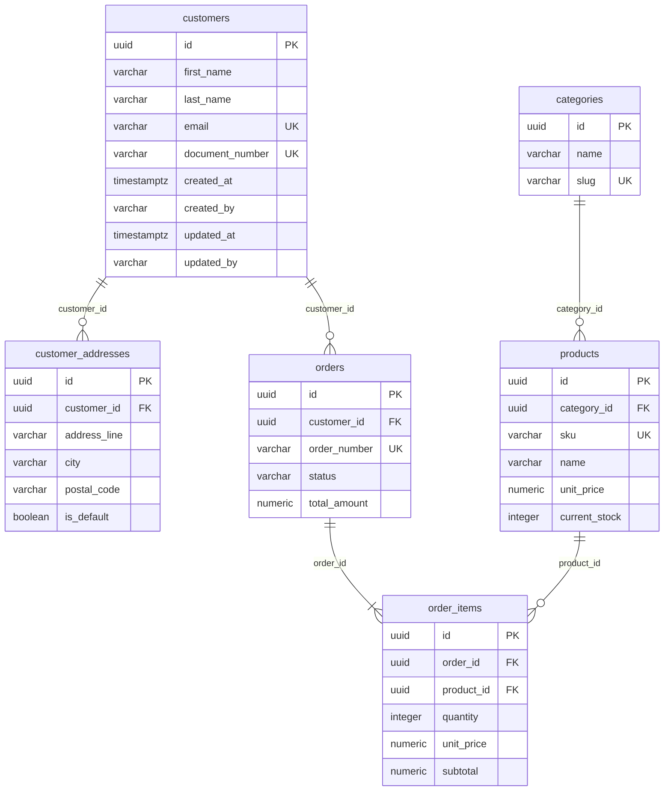

# Worked example: enterprise e-commerce

One domain carried through every level of the workflow, ending with the validation checklist.

## 1. Conceptual ERD



## 2. Logical ERD (`UpperCamelCase`, singular)



`OrderItem.UnitPrice` is not a 3NF violation: it is the price *at purchase time*, a different fact from the product's current price.

## 3. Physical ERD (`snake_case` plural, PK `id`, FK `<singular>_id`, audit columns)



## 4. Production DDL (PostgreSQL)

```sql
CREATE EXTENSION IF NOT EXISTS "pgcrypto";

CREATE TABLE customers (
    id UUID PRIMARY KEY DEFAULT gen_random_uuid(),
    first_name VARCHAR(100) NOT NULL,
    last_name VARCHAR(100) NOT NULL,
    email VARCHAR(255) NOT NULL,
    document_number VARCHAR(30) NOT NULL,
    created_at TIMESTAMPTZ NOT NULL DEFAULT CURRENT_TIMESTAMP,
    created_by VARCHAR(100) NOT NULL,
    updated_at TIMESTAMPTZ NOT NULL DEFAULT CURRENT_TIMESTAMP,
    updated_by VARCHAR(100) NOT NULL,
    CONSTRAINT uk_customers_email UNIQUE (email),
    CONSTRAINT uk_customers_document_number UNIQUE (document_number)
);

CREATE TABLE customer_addresses (
    id UUID PRIMARY KEY DEFAULT gen_random_uuid(),
    customer_id UUID NOT NULL,
    address_line VARCHAR(255) NOT NULL,
    city VARCHAR(100) NOT NULL,
    postal_code VARCHAR(20) NOT NULL,
    is_default BOOLEAN NOT NULL DEFAULT FALSE,
    created_at TIMESTAMPTZ NOT NULL DEFAULT CURRENT_TIMESTAMP,
    created_by VARCHAR(100) NOT NULL,
    updated_at TIMESTAMPTZ NOT NULL DEFAULT CURRENT_TIMESTAMP,
    updated_by VARCHAR(100) NOT NULL,
    CONSTRAINT fk_customer_addresses_customer_id FOREIGN KEY (customer_id)
        REFERENCES customers(id) ON DELETE RESTRICT
);

CREATE TABLE categories (
    id UUID PRIMARY KEY DEFAULT gen_random_uuid(),
    name VARCHAR(100) NOT NULL,
    slug VARCHAR(120) NOT NULL,
    created_at TIMESTAMPTZ NOT NULL DEFAULT CURRENT_TIMESTAMP,
    created_by VARCHAR(100) NOT NULL,
    updated_at TIMESTAMPTZ NOT NULL DEFAULT CURRENT_TIMESTAMP,
    updated_by VARCHAR(100) NOT NULL,
    CONSTRAINT uk_categories_slug UNIQUE (slug)
);

CREATE TABLE products (
    id UUID PRIMARY KEY DEFAULT gen_random_uuid(),
    category_id UUID NOT NULL,
    sku VARCHAR(64) NOT NULL,
    name VARCHAR(200) NOT NULL,
    unit_price NUMERIC(12, 2) NOT NULL,
    current_stock INTEGER NOT NULL,
    created_at TIMESTAMPTZ NOT NULL DEFAULT CURRENT_TIMESTAMP,
    created_by VARCHAR(100) NOT NULL,
    updated_at TIMESTAMPTZ NOT NULL DEFAULT CURRENT_TIMESTAMP,
    updated_by VARCHAR(100) NOT NULL,
    CONSTRAINT uk_products_sku UNIQUE (sku),
    CONSTRAINT fk_products_category_id FOREIGN KEY (category_id)
        REFERENCES categories(id) ON DELETE RESTRICT,
    CONSTRAINT chk_products_unit_price CHECK (unit_price >= 0.00),
    CONSTRAINT chk_products_current_stock CHECK (current_stock >= 0)
);

CREATE TABLE orders (
    id UUID PRIMARY KEY DEFAULT gen_random_uuid(),
    customer_id UUID NOT NULL,
    order_number VARCHAR(32) NOT NULL,
    status VARCHAR(20) NOT NULL DEFAULT 'PENDING',
    total_amount NUMERIC(12, 2) NOT NULL DEFAULT 0.00,
    created_at TIMESTAMPTZ NOT NULL DEFAULT CURRENT_TIMESTAMP,
    created_by VARCHAR(100) NOT NULL,
    updated_at TIMESTAMPTZ NOT NULL DEFAULT CURRENT_TIMESTAMP,
    updated_by VARCHAR(100) NOT NULL,
    CONSTRAINT uk_orders_order_number UNIQUE (order_number),
    CONSTRAINT fk_orders_customer_id FOREIGN KEY (customer_id)
        REFERENCES customers(id) ON DELETE RESTRICT,
    CONSTRAINT chk_orders_status CHECK (status IN ('PENDING','PAID','SHIPPED','DELIVERED','CANCELLED')),
    CONSTRAINT chk_orders_total_amount CHECK (total_amount >= 0.00)
);

CREATE TABLE order_items (
    id UUID PRIMARY KEY DEFAULT gen_random_uuid(),
    order_id UUID NOT NULL,
    product_id UUID NOT NULL,
    quantity INTEGER NOT NULL,
    unit_price NUMERIC(12, 2) NOT NULL,
    subtotal NUMERIC(12, 2) NOT NULL,
    created_at TIMESTAMPTZ NOT NULL DEFAULT CURRENT_TIMESTAMP,
    created_by VARCHAR(100) NOT NULL,
    updated_at TIMESTAMPTZ NOT NULL DEFAULT CURRENT_TIMESTAMP,
    updated_by VARCHAR(100) NOT NULL,
    CONSTRAINT fk_order_items_order_id FOREIGN KEY (order_id)
        REFERENCES orders(id) ON DELETE CASCADE,
    CONSTRAINT fk_order_items_product_id FOREIGN KEY (product_id)
        REFERENCES products(id) ON DELETE RESTRICT,
    CONSTRAINT chk_order_items_quantity CHECK (quantity > 0),
    CONSTRAINT chk_order_items_unit_price CHECK (unit_price >= 0.00),
    CONSTRAINT chk_order_items_subtotal CHECK (subtotal >= 0.00)
);

-- Explicit foreign-key indexes (prevent contention and full scans)
CREATE INDEX idx_customer_addresses_customer_id ON customer_addresses(customer_id);
CREATE INDEX idx_products_category_id ON products(category_id);
CREATE INDEX idx_orders_customer_id ON orders(customer_id);
CREATE INDEX idx_orders_status ON orders(status);
CREATE INDEX idx_order_items_order_id ON order_items(order_id);
CREATE INDEX idx_order_items_product_id ON order_items(product_id);
```

`orders.total_amount` is a deliberate denormalization of the sum of its items; it is kept consistent inside the order aggregate's transaction. That is the decision record.

## 5. Document store for the dynamic catalog (MongoDB)

The product catalog has dynamic attributes (sizes, technical specs, reviews) — a measured fit for a document collection, with the RDBMS remaining the source of truth for `products`.

```javascript
db.createCollection("product_catalogs", {
   validator: {
      $jsonSchema: {
         bsonType: "object",
         required: [ "sku", "name", "category_slug", "price", "is_active", "created_at" ],
         properties: {
            sku:           { bsonType: "string" },
            name:          { bsonType: "string" },
            category_slug: { bsonType: "string" },
            price:         { bsonType: "decimal", minimum: 0 },
            attributes:    { bsonType: "object" },
            tags:          { bsonType: "array", items: { bsonType: "string" } },
            is_active:     { bsonType: "bool" },
            created_at:    { bsonType: "date" }
         }
      }
   }
});

db.product_catalogs.createIndex({ "sku": 1 }, { unique: true });
db.product_catalogs.createIndex({ "category_slug": 1, "is_active": 1 });
```

## 6. Key-value store for sessions and carts (Redis)

```text
session:<user_uuid>               -> String (JWT / serialized metadata)   [TTL: 86400s]
cart:<user_uuid>                  -> Hash { product_id: quantity }        [TTL: 604800s]
product:stock:lock:<product_uuid> -> String (transaction UUID)            [TTL: 300s]
```

## Validation checklist

- [ ] Was the conceptual model validated with domain experts?
- [ ] Does the logical model satisfy 3NF (or BCNF where required)?
- [ ] Are logical entity names `UpperCamelCase` singular?
- [ ] Are physical table names `snake_case` plural?
- [ ] Is every physical primary key strictly `id` (preferably `UUID`)?
- [ ] Do foreign keys follow `<singular_entity>_id`?
- [ ] Does every physical table include the four audit columns?
- [ ] Are there explicit indexes on all foreign keys?
- [ ] Are critical business constraints enforced in the database (`CHECK`, `UNIQUE`, `NOT NULL`)?
- [ ] Is every denormalization documented with its measurement and its consistency mechanism?
- [ ] Have N+1 risks in the ORM layer been checked against the generated SQL?
- [ ] Does each piece of data duplicated across engines have a declared source of truth?
- [ ] Are DDL migrations versioned in immutable sequential files in the repository?
