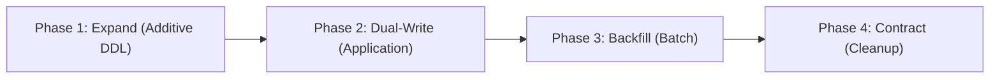

# Step 5 — Zero-Downtime Schema Migrations (Expand / Contract)

In production databases operating under continuous traffic, altering tables or locking schemas causes request timeouts, connection pool exhaustion, and outages. All schema changes must follow the **Expand / Contract (Parallel Run)** pattern.

---

## The 4-Phase Expand / Contract Lifecycle



### Phase 1: Expand (Backward-Compatible DDL)
- Add new columns as **nullable** or with safe defaults.
- Create new tables or views without modifying existing queries.
- Build indexes concurrently to avoid write locks:
  ```sql
  -- PostgreSQL non-blocking index creation
  CREATE INDEX CONCURRENTLY idx_orders_customer_status 
  ON orders (customer_id, status);
  ```

### Phase 2: Dual-Write / Transitional Reads
- Deploy application version N+1.
- Application writes to **both** legacy and new columns/tables within a single database transaction.
- Read operations still point to the legacy structure or fall back gracefully.

### Phase 3: Historical Backfill
- Run an asynchronous, idempotent batch migration script to populate historical rows in chunks (e.g., 1000 rows per batch) to prevent table-level locks:
  ```sql
  -- Batch update with sleep / transaction throttling
  UPDATE orders
  SET full_name = first_name || ' ' || last_name
  WHERE full_name IS NULL
    AND id IN (
      SELECT id FROM orders 
      WHERE full_name IS NULL 
      ORDER BY id 
      LIMIT 1000
    );
  ```

### Phase 4: Contract (Destructive DDL)
- Deploy application version N+2, pointing all read and write queries exclusively to the new structure.
- Verify zero database queries touch the legacy column.
- Safely drop the old column/table in a low-traffic window:
  ```sql
  ALTER TABLE orders DROP COLUMN legacy_column;
  ```

---

## PostgreSQL-Specific Safe DDL Checklist

| Operation | ❌ Dangerous DDL (Locks Table) | ✅ Safe DDL (Zero-Downtime) |
| :--- | :--- | :--- |
| **Add Index** | `CREATE INDEX idx ON tbl(col);` | `CREATE INDEX CONCURRENTLY idx ON tbl(col);` |
| **Add NOT NULL** | `ALTER TABLE tbl ALTER col SET NOT NULL;` | `ALTER TABLE tbl ADD CONSTRAINT chk_col_not_null CHECK (col IS NOT NULL) NOT VALID;`<br>`ALTER TABLE tbl VALIDATE CONSTRAINT chk_col_not_null;` |
| **Rename Column** | `ALTER TABLE tbl RENAME COLUMN old TO new;` | Add new column `new`, dual-write, backfill, drop `old`. |
| **Add FK** | `ALTER TABLE tbl ADD CONSTRAINT fk REFERENCES ...;` | `ALTER TABLE tbl ADD CONSTRAINT fk REFERENCES ... NOT VALID;`<br>`ALTER TABLE tbl VALIDATE CONSTRAINT fk;` |
| **Change Data Type** | `ALTER TABLE tbl ALTER col TYPE new_type;` | Add `col_new`, dual-write, backfill, switch reads, drop `col`. |
