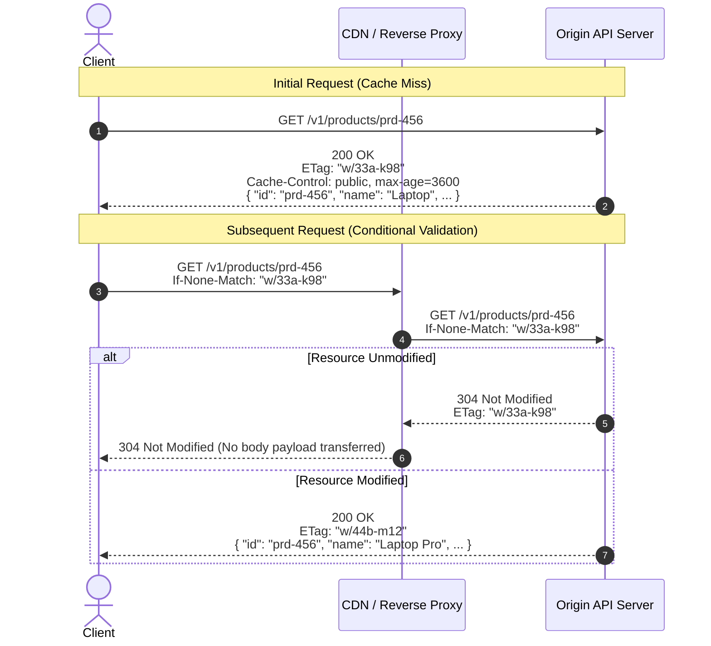
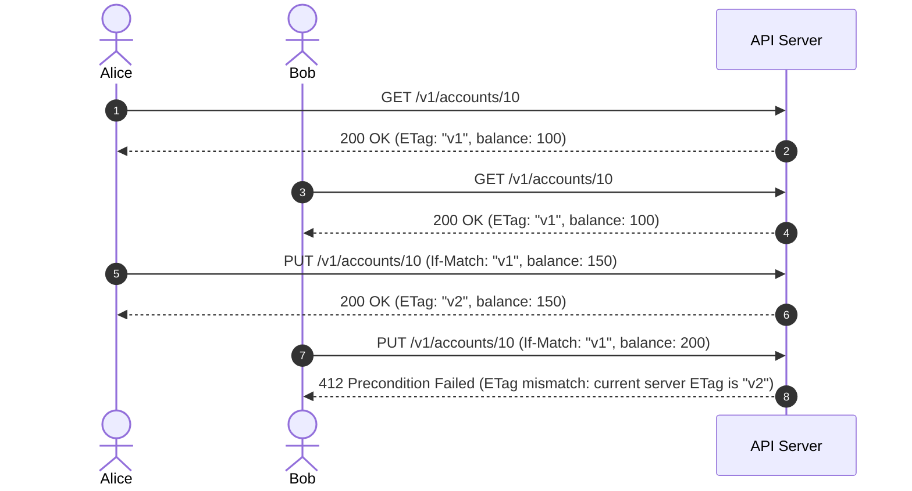

# Step 5 — Cache-Control, ETag & If-Match optimistic concurrency

## 1. HTTP Caching Mechanics (RFC 9111)

HTTP caching allows browsers, edge CDNs, and reverse proxies to serve repeated read requests without querying origin database servers.



### Cache-Control Directives
Configure `Cache-Control` explicitly on **every** response:
* **Private / Sensitive / Dynamic data**:
  `Cache-Control: private, no-cache, no-store, must-revalidate`
* **Public / Cacheable data**:
  `Cache-Control: public, max-age=300, stale-while-revalidate=60`
* **Immutable static assets**:
  `Cache-Control: public, max-age=31536000, immutable`

---

## 2. Optimistic Concurrency with ETag and If-Match

The **lost-update problem** occurs when two clients read the same resource simultaneously and overwrite each other's changes. HTTP solves this natively without pessimistic database locks.



### Concurrency Protocol Rules:
1. **Server ETag Generation**: Generate the `ETag` from the entity's monotonic version number or a SHA-256 hash of its representation state.
2. **Client Mutation**: The client transmits the current version in the `If-Match: "<ETag>"` header on `PUT`, `PATCH`, or `DELETE`.
3. **Precondition Enforcement**: If the incoming `If-Match` does not match the database version, abort the transaction immediately and return `412 Precondition Failed` (or `428 Precondition Required` if the header was omitted).

---

## 3. Dynamic Hypermedia Controls (HATEOAS)

When targeting Richardson Maturity Model Level 3, the representation contains embedded hypermedia links (`_links`) communicating legal, state-dependent actions:

```json
{
  "id": "ord-8812",
  "status": "APPROVED",
  "totalAmount": 250.00,
  "_links": {
    "self": { "href": "/v1/orders/ord-8812" },
    "payment": { "href": "/v1/orders/ord-8812/payment", "method": "POST" },
    "cancel": { "href": "/v1/orders/ord-8812/cancellation", "method": "POST" }
  }
}
```

* **State-Dependent Links**: If the order moves to `PAID`, the server removes the `payment` and `cancel` links and emits a `shipment` link instead.
* **Benefit**: Business workflow rules stay encapsulated on the server rather than hard-coded into client application logic.
