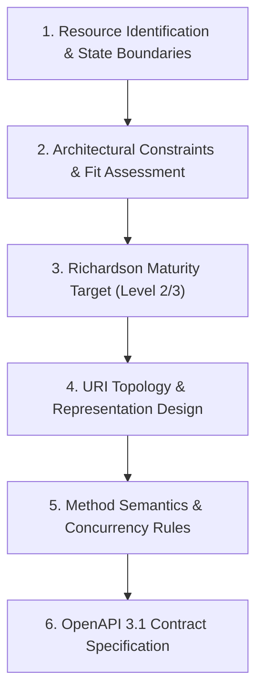

# Step 1 — Architecture & Resource Modeling

An engineering procedure for designing a Resource-Oriented Architecture (ROA) from a domain model, validating Fielding's constraints, and setting the target Richardson Maturity Model level.

## Resource-Oriented Architecture (ROA) vs RPC vs SOAP

The fundamental architectural difference lies in the central pivot of interaction:

| Criterion | Resource-Oriented (REST / ROA) | Remote Procedure Call (gRPC / JSON-RPC) | SOAP |
| :--- | :--- | :--- | :--- |
| **Central Pivot** | **Resource** (noun identified by a URI). | **Procedure / function** (verb, invocable method). | **Service / operation** (message in XML envelope). |
| **Interface** | **Uniform and generic** (`GET`, `POST`, `PUT`, `DELETE`, `PATCH`). | **Specific per function** (`createUser()`, `cancelOrder()`). | **Specific, described in WSDL** (`ProcessOrderRequest`). |
| **Coupling** | **Low** (standard protocol, open formats, evolvable). | **Medium / high** (binary interface contracts / rigid schemas). | **High** (strict XML schemas, complex WS-* stacks). |
| **Use of HTTP** | **Semantic application protocol** (status codes, methods, headers). | **Transport tunnel** (almost always POST over HTTP/2 or HTTP/1.1). | **Transport tunnel** (POST tunneling, errors inside 200 responses). |
| **Caching** | **Native and distributed** (RFC 9111 headers, CDNs, proxies). | **Application-managed** (custom caching logic required). | **Not native** (impossible for standard intermediaries). |

## Fielding's Architectural Constraints

To achieve scalability, independent evolvability, and visibility, an HTTP API adheres to Fielding's constraints:

1. **Client-Server Separation**: Separation of user concerns (UI/client) from data storage and business invariants (server). Enables independent evolution across mobile, web, and microservices.
2. **Statelessness**: Every request must carry **all information necessary** to authenticate and process it (`Authorization: Bearer <token>`). The server holds no session context across requests in local memory (`HttpSession`), enabling trivial horizontal scaling behind load balancers.
3. **Cacheability**: Every response explicitly defines its caching semantics (`Cache-Control`, `ETag`, `Last-Modified`) to optimize latency and eliminate redundant network transfers.
4. **Uniform Interface**:
   - *Resource Identification*: Resources are uniquely addressed by stable URIs.
   - *Manipulation via Representations*: Clients manipulate server resources by exchanging representations (JSON) and metadata.
   - *Self-Descriptive Messages*: Each message declares how to parse and handle it (`Content-Type`, `Accept`, `Cache-Control`).
   - *HATEOAS*: Clients navigate state transitions dynamically via embedded hypermedia links.
5. **Layered System**: The client cannot tell whether it is communicating with the origin server or an intermediary (API Gateway, CDN, reverse proxy, load balancer). Security, TLS termination, and rate limiting can be inserted transparently.

## Richardson Maturity Model

| Level | Name | Description | Production Target |
| :--- | :--- | :--- | :--- |
| **Level 0** | Swamp of POX | Single URI endpoint, all operations tunneled via `POST` with action embedded in payload. | Avoid entirely. |
| **Level 1** | Resources | Multiple URIs identify different domain entities, but operations still use a single verb (typically `POST`). | Transition to Level 2. |
| **Level 2** | HTTP Verbs & Status Codes | Semantic methods (`GET`, `POST`, `PUT`, `PATCH`, `DELETE`) with canonical HTTP status codes (200, 201, 204, 400, 404, 409, 412, 422, 500). | **Standard Industry Baseline**. Highly recommended for internal/microservice APIs. |
| **Level 3** | Hypermedia Controls (HATEOAS) | Responses contain state-dependent links (`_links`) declaring valid next actions. | Recommended for long-lived, multi-client, or public B2B platforms. |

## Step-by-step Design Procedure

### Step 1: Delimit Domain Entities and Aggregate Roots
- Map DDD aggregate roots directly to primary REST resources (`/loan-applications`).
- Map dependent entities as subordinate sub-resources (`/loan-applications/{id}/documents`) or link relationships.
- A resource is an addressable conceptual entity, not a 1:1 database table reflection.

### Step 2: Separate Resource State from Application State
- **Resource State**: Persistent business domain data on the server (records, lifecycle statuses). Modified only via explicit HTTP mutations (`POST`, `PUT`, `PATCH`, `DELETE`).
- **Application State**: Client-side navigation context (active screen, wizard step, query filter). Lives **strictly in the client** or is passed as query parameters.

### Step 3: Design URI Topology & Collection Semantics
- Use lowercase, plural nouns separated by hyphens (`kebab-case`). Limit nesting to a maximum of 2 levels (e.g. `/orders/{id}/items`).
- See [uris-and-collections.md](uris-and-collections.md).

### Step 4: Map Operations to HTTP Methods
- Enforce strict method semantics, safety, and idempotency guarantees.
- See [method-semantics.md](method-semantics.md).

### Step 5: Define Status Codes & Deterministic Error Formats
- Map all possible outcomes to canonical status codes. Enforce RFC 7807 / RFC 9457 `application/problem+json` for error handling.
- See [status-codes-and-errors.md](status-codes-and-errors.md).

### Step 6: Configure Caching, Concurrency & ETag Directives
- Implement optimistic concurrency via `ETag` and `If-Match`. Configure explicit `Cache-Control` headers.
- See [caching-and-concurrency.md](caching-and-concurrency.md).

### Step 7: Specify the Formal OpenAPI 3.1 Contract
- Adopt an **API-First** approach: author the OpenAPI 3.1 specification, validate with consumers, and lint in CI before implementation.
- See [worked-example.md](worked-example.md).
