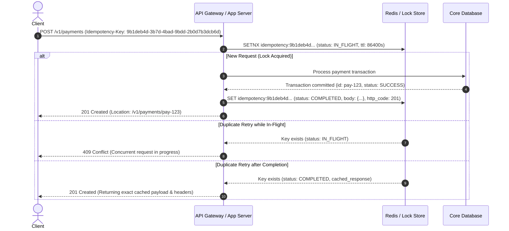

# Step 3 — HTTP method semantics, safety & idempotency keys

IETF RFC 9110 formally establishes the fundamental semantic properties for HTTP/1.1 and HTTP/2/3 methods:

* **Safe Method**: Guarantees zero side effects on the state of server resources. Repeated invocations are strictly read-only and can be prefetched or cached without risk.
* **Idempotent Method**: The intended effect of multiple identical requests on the server's resource state is identical to the effect of a single request (`f(f(x)) = f(x)`). Network intermediaries or clients may safely retry failed idempotent calls.

## Method Comparison Matrix

| Method | Specification | Safe | Idempotent | Operational Purpose & Semantics |
| :--- | :--- | :---: | :---: | :--- |
| `GET` | RFC 9110 §9.3.1 | **Yes** | **Yes** | Retrieves representation of the target resource. Never mutates state. |
| `HEAD` | RFC 9110 §9.3.2 | **Yes** | **Yes** | Same as `GET` but omits the response body. Used to verify resource existence or inspect headers (`ETag`, `Content-Length`). |
| `OPTIONS` | RFC 9110 §9.3.7 | **Yes** | **Yes** | Communicates supported methods (`Allow: GET, POST, OPTIONS`) and CORS preflight options. |
| `POST` | RFC 9110 §9.3.3 | **No** | **No** | Processes enclosed representation to create a subordinate resource or execute non-idempotent business logic. |
| `PUT` | RFC 9110 §9.3.4 | **No** | **Yes** | **Complete replacement** of the resource at target URI. Client sends the full representation. If fields are omitted, they are reset/removed. |
| `PATCH` | RFC 5789 | **No** | **Conditional\*** | **Partial modification** by applying a delta. When using field-replacement formats (RFC 7386), operations behave idempotently. |
| `DELETE` | RFC 9110 §9.3.5 | **No** | **Yes** | Requests deletion of target resource. Repeated requests leave the resource deleted (returning 204 or 404). |

> **PATCH Standards**: Never invent custom/ad-hoc JSON patch formats. Choose between:
> 1. **JSON Merge Patch (RFC 7386)** `application/merge-patch+json`: Client sends a partial JSON object containing only changed fields (`null` explicitly deletes a field).
> 2. **JSON Patch (RFC 6902)** `application/json-patch+json`: Client sends an array of atomic mutation operations (`add`, `remove`, `replace`, `move`, `copy`, `test`).

## Idempotency-Key for Critical Mutations

Because `POST` is not naturally idempotent, network drops or timeouts can result in duplicate orders, double-charges, or orphaned tasks upon client retries.

### Implementation Protocol
1. **Client Responsibility**: Client generates a unique UUIDv4 per distinct logical operation and sends `Idempotency-Key: <UUID>` header.
2. **Server Storage**: Server stores the idempotency key with operation status (`IN_FLIGHT`, `COMPLETED`), response status code, and response body for 24 to 72 hours.
3. **Payload Mismatch Check**: If a retry arrives with an identical key but a different request payload hash, return `422 Unprocessable Content` or `400 Bad Request` with an explanatory error.
