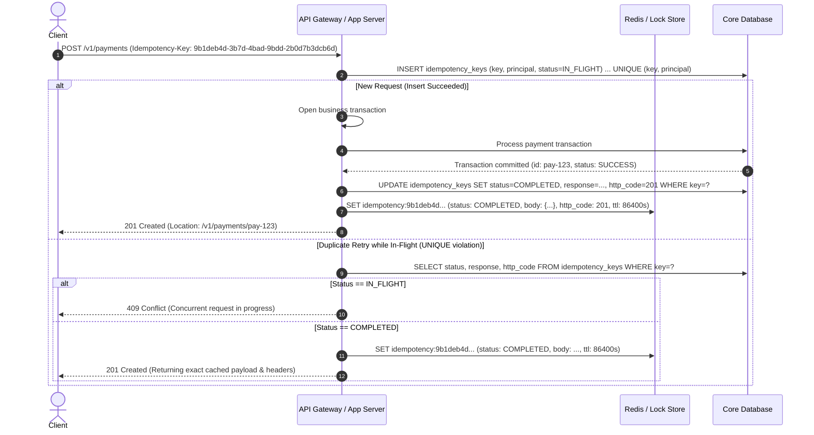

# Step 3 — HTTP method semantics, safety & idempotency keys

IETF RFC 9110 formally establishes the fundamental semantic properties for HTTP/1.1 and HTTP/2/3 methods:

* **Safe Method**: Guarantees zero side effects on the state of server resources. Repeated invocations are strictly read-only and can be prefetched or cached without risk.
* **Idempotent Method**: The intended effect of multiple identical requests on the server's resource state is identical to the effect of a single request (`f(f(x)) = f(x)`). Network intermediaries or clients may safely retry failed idempotent calls. Note: idempotency is a property of the *intended effect on resource state*. Recovering a previously failed request whose outcome is genuinely unknown is not a question of HTTP semantics — it requires a separate `Idempotency-Key` and a durable record of the operation.

## Method Comparison Matrix

| Method | Specification | Safe | Idempotent | Operational Purpose & Semantics |
| :--- | :--- | :---: | :---: | :--- |
| `GET` | RFC 9110 §9.3.1 | **Yes** | **Yes** | Retrieves representation of the target resource. Never mutates state. |
| `HEAD` | RFC 9110 §9.3.2 | **Yes** | **Yes** | Same as `GET` but omits the response body. Used to verify resource existence or inspect headers (`ETag`, `Content-Length`). |
| `OPTIONS` | RFC 9110 §9.3.7 | **Yes** | **Yes** | Communicates supported methods (`Allow: GET, POST, OPTIONS`) and CORS preflight options. |
| `POST` | RFC 9110 §9.3.3 | **No** | **No** | Processes enclosed representation to create a subordinate resource or execute non-idempotent business logic. |
| `PUT` | RFC 9110 §9.3.4 | **No** | **Yes** | **Complete replacement** of the resource at target URI. Client sends the full representation. If fields are omitted, they are reset/removed. |
| `PATCH` | RFC 5789 | **No** | **Conditional\*** | **Partial modification** by applying a delta. When using field-replacement formats (RFC 7386), operations behave idempotently. |
| `DELETE` | RFC 9110 §9.3.5 | **No** | **Yes** | Requests deletion of target resource. Repeated requests leave the resource deleted (returning 204 or 404). |

> **PATCH Standards**: Never invent custom/ad-hoc JSON patch formats. Choose between:
> 1. **JSON Merge Patch (RFC 7386)** `application/merge-patch+json`: Client sends a partial JSON object containing only changed fields (`null` explicitly deletes a field).
> 2. **JSON Patch (RFC 6902)** `application/json-patch+json`: Client sends an array of atomic mutation operations (`add`, `remove`, `replace`, `move`, `copy`, `test`).

## Idempotency-Key for Critical Mutations

Because `POST` is not naturally idempotent, network drops or timeouts can result in duplicate orders, double-charges, or orphaned tasks upon client retries.

The example below illustrates a Redis-accelerated idempotency layer. **Redis is a cache, not the source of truth.** The durable record of a completed operation must live in the same transaction as the side effect (typically via an `UNIQUE` constraint on a `(principal_id, idempotency_key)` column), so that a crash between commit and cache write cannot let a retry double-charge. The Redis layer is a shortcut for the hot path, never the only evidence.

**Why the diagram is structured this way.** A naive Redis-only design (`SETNX ... IN_FLIGHT` before commit, then `SET ... COMPLETED` after) silently loses effect evidence if the process crashes between commit and cache write: a later retry will see no key and may repeat the operation. Pairing the idempotency record with the business write inside the same transaction collapses that window to zero; the cache is a latency optimization on top of a durable, atomic decision.

### Implementation Protocol
1. **Client Responsibility**: Client generates a unique UUIDv4 per distinct logical operation and sends `Idempotency-Key: <UUID>` header.
2. **Durable Storage**: Persist the idempotency record (`key`, `principal`, `status`, `response`, `http_code`) **in the same transaction as the business write**, with `UNIQUE (key, principal)`. The cache copy (Redis or similar) is optional; the database row is authoritative.
3. **Cache as Accelerator**: After the durable record commits, write the cache copy with a bounded TTL (24–72 hours). A retry hitting only Redis but missing the database (e.g. cache eviction) must re-read the database record before deciding the outcome — never trust an absent cache key alone to mean "first attempt".
4. **Payload Mismatch Check**: If a retry arrives with an identical key but a different request payload hash, return `422 Unprocessable Content` or `400 Bad Request` with an explanatory error.
5. **Retention and Recovery**: Configure a retention window for `idempotency_keys` and a periodic sweeper that demotes `IN_FLIGHT` rows older than the maximum expected request lifetime to `EXPIRED`. Operators must alert on `EXPIRED` rate; a high rate usually means the client gave up before the response.
6. **Distributed / Third-Party Effects**: When the side effect targets an external payment or messaging provider, also send a stable provider-side idempotency key (when supported) and reconcile unconfirmed rows on a schedule. Do not assume the Redis layer alone is sufficient.

## External validation

The "hint + durable record + periodic reconcile" structure is not theoretical. In production-style deployments (for example, a gateway pulling from a backend over intermittent connectivity), webhooks occasionally fail because the receiver is offline at the moment of dispatch; the periodic reconcile catches up within its poll interval. This is exactly what the durable record enables. Two operational corollaries follow:

- Treat the cache layer (Redis and similar) as best-effort. The database row is the only authoritative evidence that "this exact effect happened once". A missing cache key never proves a first attempt; only the absence of the row does.
- The end-to-end window the contract commits to is bounded by *reconcile interval + database read latency*, not by webhook latency. If you promise sub-second de-duplication in a product surface, you are promising reconcile latency, not hint latency.
