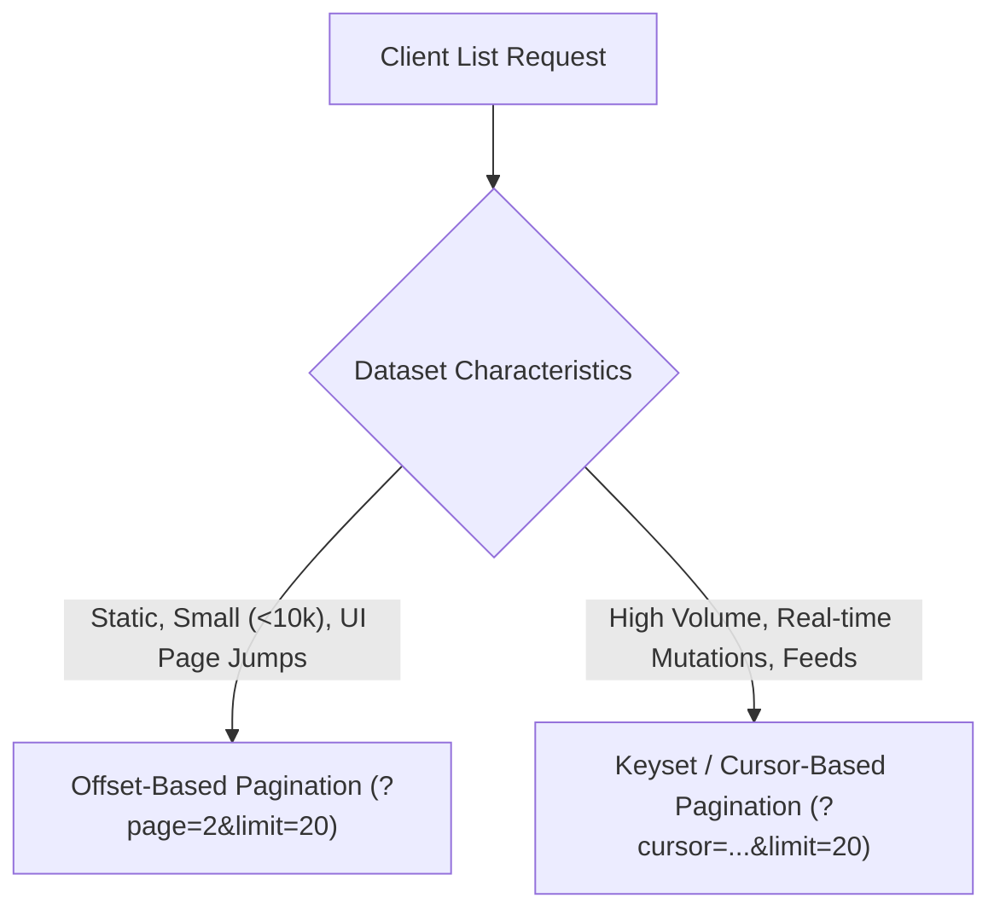

# Step 2 — Resource URIs, filtering, sorting and keyset pagination

## URI Naming Conventions

* **Plural nouns**: Collections and resources are identified using lowercase plural nouns (`/orders`, `/users`, `/invoices`).
* **Kebab-case formatting**: Hyphens separate compound words in path segments (`/payment-methods`, `/shipping-addresses`).
* **No verbs in URIs**: The HTTP method specifies the action. Never use verbs for CRUD operations.
* **No file extensions**: Content format is negotiated via the `Accept` and `Content-Type` headers (`application/json`), not `.json` in the URI.
* **Hierarchy and nesting limits**:
  * Root Collection: `/customers`
  * Resource Instance: `/customers/{customerId}`
  * Sub-collection: `/customers/{customerId}/addresses`
  * Sub-resource Instance: `/customers/{customerId}/addresses/{addressId}`
  * **Rule of 2 Levels**: Never nest beyond two levels. Prefer `/orders/{orderId}/items` over `/enterprises/{orgId}/regions/{regId}/customers/{custId}/orders/{orderId}/items`. Beyond two levels, make the child resource a top-level resource with query filtering (e.g., `/order-items?orderId={orderId}`).

```
CORRECT:  GET /purchase-orders/992/line-items
BAD:      GET /getPurchaseOrderLineItems?id=992   (RPC verb tunneling)
BAD:      POST /purchase_order/delete/992         (embedded verb and snake_case)
BAD:      GET /customers/10.json                  (file extension instead of Accept header)
```

## Non-CRUD Actions as Sub-resources

When a business operation cannot be expressed as standard resource mutation (e.g. initiating a calculation, triggering an approval, or executing a refund), model the action as a subordinate execution resource:

```
POST /orders/{id}/cancellation
POST /payments/{id}/refund
POST /reports/export-jobs
```

## Filtering, Sorting, and Projections

Parameters that modify the *view* or *projection* of a resource—without altering its identity—belong in the query string:

* **Field Filtering**: `GET /orders?status=PENDING&currency=USD`
* **Range Filtering**: `GET /invoices?createdAfter=2026-01-01T00:00:00Z&createdBefore=2026-06-30T23:59:59Z`
* **Sorting**: `GET /orders?sort=-createdAt,totalAmount` (the `-` prefix denotes descending order).
* **Sparse Fieldsets (Projections)**: `GET /customers/123?fields=id,firstName,email`
* **Embedding Subordinate Resources**: `GET /orders/10?include=items,shippingAddress`

> **Strict Parameter Validation**: Validate all query parameters and immediately reject unknown or malformed parameters with `400 Bad Request`. Silently ignoring unrecognized parameters (such as a typo `?stauts=PAID`) leads to unintended full-collection responses and client bugs.

## Pagination Strategies

Every collection endpoint **must be paginated defensively**. Unbounded list endpoints are strictly prohibited.



### 1. Keyset / Cursor-Based Pagination (Recommended Default)

Keyset pagination uses indexed sequential attributes (e.g. `created_at, id`) to navigate directly to the next page using indexed `WHERE` conditions rather than skipping rows.

* **Query Syntax**:
  ```http
  GET /v1/orders?limit=25&cursor=eyJpZCI6ImFwcC05OTAxIiwiY3JlYXRlZEF0IjoiMjAyNi0wOC0yNVQxMDowMDowMFoifQ==
  ```
* **Mechanism**:
  - The `cursor` is an opaque, URL-safe base64-encoded token containing the sorting key of the last item in the previous page (`{ id: "app-9901", createdAt: "2026-08-25T10:00:00Z" }`).
  - Underlying SQL query executed on the database:
    ```sql
    SELECT id, order_number, total_amount, created_at
    FROM orders
    WHERE (created_at, id) < ('2026-08-25T10:00:00Z', 'app-9901')
    ORDER BY created_at DESC, id DESC
    LIMIT 26;
    ```
* **Advantages**:
  - **$O(1)$ Performance**: Scales independently of dataset size via composite index `(created_at DESC, id DESC)`.
  - **Deterministic**: Resilient to concurrent inserts/deletions—no duplicate or skipped items across pages.
* **Payload Structure**:
  ```json
  {
    "items": [ ... ],
    "pagination": {
      "limit": 25,
      "nextCursor": "eyJpZCI6ImFwcC05ODc2IiwiY3JlYXRlZEF0IjoiMjAyNi0wOC0yNVQwOTo1ODoxMVoifQ==",
      "hasMore": true
    }
  }
  ```

### 2. Offset-Based Pagination

* **Query Syntax**: `GET /v1/articles?page=2&limit=20` (or `offset=20&limit=20`).
* **Limitations**:
  - **$O(N)$ Database Scan**: `OFFSET 1000000` forces the database to read and discard 1,000,000 rows.
  - **Pagination Drift**: Inserting a new row shifts offsets, causing items to appear on multiple pages.
* **Acceptable Use**: Administrative tables with fewer than 10,000 total rows requiring direct random page jumps (e.g., jump to page 4).

## Defensive Defaults

Every collection endpoint must enforce:
1. `default_limit = 20` (or 50)
2. `max_limit = 100` (reject requests requesting `limit > 100` with `400 Bad Request` or clamp to maximum).
