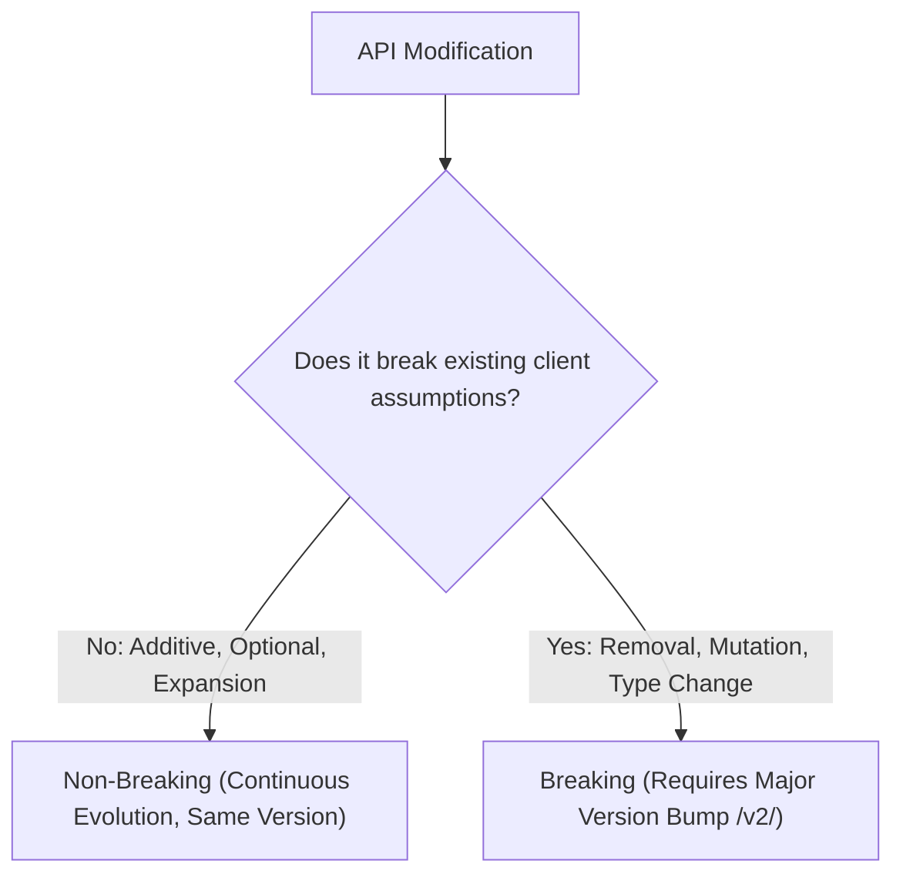

# Step 6 — API evolvability, versioning & deprecation

## Versioning Strategies

| Strategy | Pattern | Strengths | Trade-offs |
| :--- | :--- | :--- | :--- |
| **URI Path (Recommended)** | `/v1/orders`<br/>`/v2/orders` | Explicit, browser-testable, simple routing at API gateways and CDNs. | Different URIs represent the same logical domain concept. |
| **Content Negotiation** | `Accept: application/vnd.company.v1+json` | Preserves URI stability and resource identity. | Complex proxy caching and harder manual testing in browsers. |
| **Custom Header** | `X-API-Version: 1.0` | Keeps URIs clean. | Non-standard; requires explicit header propagation in proxies. |

## Classification: Breaking vs Non-Breaking Changes



### Non-Breaking Changes (Safe to deploy in-place)
* Adding a new endpoint or resource path.
* Adding a new optional request field or query parameter with a sensible default.
* Adding a new attribute to a JSON response (clients must implement robust open-content parsing and ignore unknown fields).
* Adding a new enum value to an *input* parameter accepted by the server.

### Breaking Changes (Requires new major version `/v2/`)
* Renaming, moving, or removing an existing request or response field.
* Changing the data type, scale, or unit of measurement of an existing field.
* Changing a previously optional request parameter to required.
* Adding a new enum value to an *output* field that clients switch over exhaustively.
* Altering an HTTP status code, error `type` URI, or default pagination order.

## Deprecation and Sunset Governance

When retiring an API version:
1. **Sunset Headers (RFC 8594)**: Transmit `Deprecation` and `Sunset` HTTP response headers:
   ```http
   Deprecation: @1790467200
   Sunset: Wed, 25 Aug 2027 00:00:00 GMT
   Link: <https://api.example.com/docs/v2-migration>; rel="sunset"
   ```
2. **Transition Window**: Run `/v1/` and `/v2/` in parallel with active traffic monitoring for a minimum of 6 to 12 months.
3. **Internal Facade**: Implement `/v1/` as a backward-compatible translation layer/facade on top of the `/v2/` domain service to avoid duplicating core business logic.
